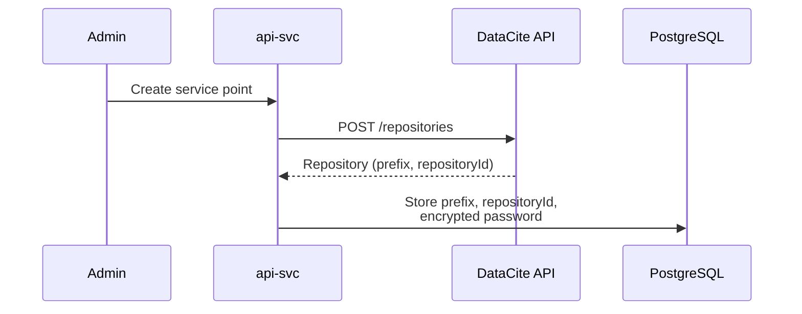
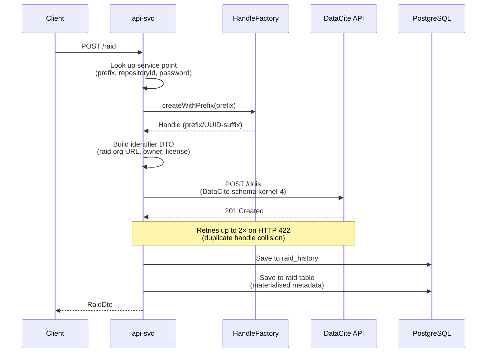
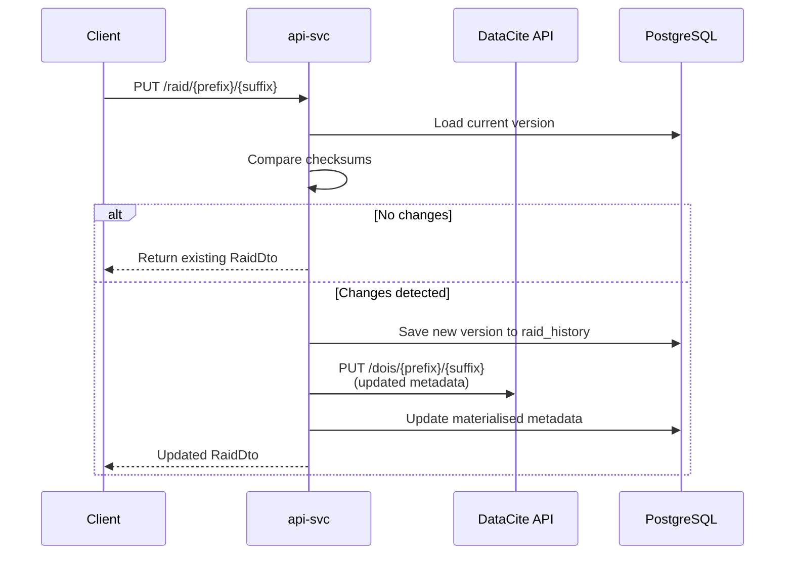
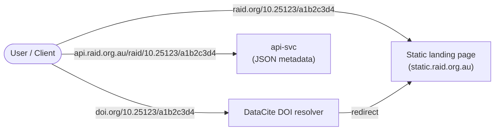

# RAiD Identifier Architecture

RAiD identifiers are minted as DOIs through the
[DataCite REST API](https://support.datacite.org/docs/api). Each RAiD
identifier follows the pattern `https://raid.org/{prefix}/{suffix}`, where the
prefix is a DataCite DOI prefix (e.g. `10.25123`) and the suffix is a random
8-character UUID segment.


## Identifier Structure

| Component        | Example                            | Source                                  |
|------------------|------------------------------------|-----------------------------------------|
| Schema URI       | `https://raid.org/`                | `raid.identifier.schema-uri`            |
| Full identifier  | `https://raid.org/10.25123/a1b2c3d4` | `name-prefix` + `prefix/suffix`       |
| DOI              | `10.25123/a1b2c3d4`               | DataCite DOI prefix + UUID segment      |
| Landing page     | `https://static.{env}.raid.org.au/raids/10.25123/a1b2c3d4` | `landing-prefix` + handle |
| Registration agency | `https://ror.org/038sjwq14`     | ARDC ROR identifier                     |
| Owner            | Service point ROR identifier       | `service_point.identifier_owner`        |


## Service Point Provisioning

Each service point is allocated its own DataCite repository, which provides
an isolated DOI prefix and API credentials. When a new service point is
created, the `DataciteRepositoryClient` calls the DataCite repositories API
to register a new repository.



Credentials are stored in the `service_point` table:

| Column           | Purpose                                       |
|------------------|-----------------------------------------------|
| `prefix`         | DataCite DOI prefix (e.g. `10.25123`)         |
| `repository_id`  | DataCite repository identifier for Basic Auth |
| `password`       | Encrypted DataCite API password               |
| `identifier_owner` | Service point ROR identifier               |


## Minting a RAiD

When a RAiD is created, the api-svc generates a handle, registers it with
DataCite, and persists the metadata.



### Handle Generation

Handles are generated by `HandleFactory`:
1. Take the service point's DOI prefix (e.g. `10.25123`)
2. Generate a random UUID and take the first 8 characters as the suffix
3. Combine as `{prefix}/{suffix}` (e.g. `10.25123/a1b2c3d4`)

If DataCite returns HTTP 422 (handle collision), the mint is retried with a
new random suffix, up to 2 times.


## Updating a RAiD

When a RAiD is updated, the api-svc pushes the updated metadata to DataCite
and saves a new version in the history.




## Resolving a RAiD

RAiD identifiers can be resolved through multiple paths:



| Resolution path | URL pattern | Returns |
|----------------|-------------|---------|
| Direct landing page | `https://static.{env}.raid.org.au/raids/{handle}` | Human-readable HTML |
| DOI resolution | `https://doi.org/{handle}` | Redirect → landing page |
| API | `https://api.{env}.raid.org.au/raid/{prefix}/{suffix}` | JSON metadata |


## DataCite Metadata Mapping

RAiD metadata is mapped to
[DataCite Schema 4](https://schema.datacite.org/meta/kernel-4/) before being
sent to the DataCite API. The mapping is handled by a chain of factory classes:

```
DataciteRequestFactory
  → DataciteDtoFactory (schema: kernel-4, type: Other)
    → DataciteAttributesDtoFactory
      → DataciteTitleFactory
      → DataciteCreatorFactory
      → DataciteDateFactory
      → DataciteContributorFactory
      → DataciteDescriptionFactory
      → DataciteRelatedIdentifierFactory
      → DataciteAlternateIdentifierFactory
      → DataciteRightsFactory
      → DataciteFundingReferenceFactory
```


## Key Source Files

| File | Purpose |
|------|---------|
| [RaidService.java](/api-svc/raid-api/src/main/java/au/org/raid/api/service/raid/RaidService.java) | Orchestrates mint, update, and read operations |
| [DataciteService.java](/api-svc/raid-api/src/main/java/au/org/raid/api/service/datacite/DataciteService.java) | POST/PUT to DataCite DOIs API |
| [DataciteRepositoryClient.java](/api-svc/raid-api/src/main/java/au/org/raid/api/client/repository/DataciteRepositoryClient.java) | Provisions DataCite repositories for service points |
| [HandleFactory.java](/api-svc/raid-api/src/main/java/au/org/raid/api/factory/HandleFactory.java) | Generates handles (prefix + UUID suffix) |
| [Handle.java](/api-svc/raid-api/src/main/java/au/org/raid/api/service/Handle.java) | Handle value object (prefix/suffix) |
| [IdFactory.java](/api-svc/raid-api/src/main/java/au/org/raid/api/factory/IdFactory.java) | Builds identifier DTOs with owner, license, URLs |
| [DataciteRequestFactory.java](/api-svc/raid-api/src/main/java/au/org/raid/api/factory/datacite/DataciteRequestFactory.java) | Maps RAiD metadata to DataCite schema |
| [DataciteProperties.java](/api-svc/raid-api/src/main/java/au/org/raid/api/config/properties/DataciteProperties.java) | DataCite endpoint configuration |
| [IdentifierProperties.java](/api-svc/raid-api/src/main/java/au/org/raid/api/config/properties/IdentifierProperties.java) | Identifier URL and schema configuration |
