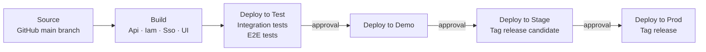

# Deployment Environment

We use the [AWS CDK](https://github.com/aws/aws-cdk) to build and deploy the
various parts of the stack.

https://github.com/au-research/raido-v2-aws-private/

The setup and configuration of your deployment process depends heavily on your
[operational environment](./operational-environment.md).

For example, our CloudFront is configured to serve the app-client from S3.
We have a AWS CodeBuild project that can be invoked to run the app-client
build process and deploy the built files to S3.  CloudFront serves those files
over the internet.

How you deploy those files will depend on your environment,
you might:
* configure your web-server to read files from a network drive (via NFS protocol
  or similar)
  * then your build process just needs to copy the files to the expected network
    location

* configure your web-server to read files from its local drive
  * then your build process would need to use `scp` or a similar protocol to 
  copy the files to each web server machine

# ARDC RAiD Service

## AWS infrastructure 

Our AWS infrastructure is deployed via an 
[AWS CDK pipeline](https://docs.aws.amazon.com/cdk/v2/guide/cdk_pipeline.html) 
in a "continuous integration" style  - i.e. AWS infrastructure is automatically 
updated when a change is pushed to the `/main` branch of the AWS repo.

## Database schema

The database instance itself is managed via CDK.
The database schema (tables, columns, triggers, etc.) is implemented as 
[Flyway](https://flywaydb.org/) migrations that are deployed by an 
[AWS CodeBuild](https://aws.amazon.com/codebuild/) task.

* [RaidoDbFlywayMigrate project](https://github.com/au-research/raido-v2-aws-private/blob/fd26c55ab476533e6c3d9c2cd6f712046b101ba1/raido-root/lib/prod/raido/RaidoDbCodeBuild.ts#L69)

## Build-Push-Deploy Pipeline

Application builds and deployments are managed by a unified
[AWS CodePipeline V2](https://docs.aws.amazon.com/codepipeline/latest/userguide/welcome.html)
called `Build-Push-Deploy-V2`. The pipeline promotes artifacts through four
environments — Test, Demo, Stage, and Prod — with manual approval gates between
each.

Version numbers follow semantic versioning, tracked in SSM parameters. A
pipeline variable (`RELEASE_TYPE`: major / minor / patch) controls how the
version is incremented at release time.

### Pipeline stages

| Stage | Steps |
|-------|-------|
| **Source** | CodeStar connection to the `raid-au` GitHub repo (`main` branch) |
| **Build** | Parallel builds: Api, Iam, Sso (Docker images → ECR), UI (Vite bundle) |
| **Test** | Deploy all services + UI to Test, run API integration tests, run Playwright E2E tests |
| **Demo** | Deploy all services + UI to Demo |
| **Stage** | Tag ECR images and Git commit as release candidates, deploy to Stage, increment RC counter |
| **Prod** | Tag ECR images and Git commit as release, deploy to Prod, save new version to SSM |

Each environment transition requires a manual approval that displays the commit
message and a link to the GitHub commit.

### ECS services

Three [AWS ECS](https://aws.amazon.com/ecs/) services run per environment:

| Service | Description | Log group |
|---------|-------------|-----------|
| **Api** | Spring Boot RAID API | `ApiV2Service` |
| **Iam** | Keycloak identity provider | `IamService` |
| **Sso** | SATOSA SAML proxy | `SsoService` |

### API build

The API build (and similarly Iam and Sso) runs as a CodeBuild project:

1. `./gradlew clean build` — compile Java, run unit tests
2. `./gradlew buildDocker -PimageName=$IMAGE_URI` — build Docker image
3. `docker push $IMAGE_URI` — push image to ECR
4. Output `imagedefinitions.json` for the ECS deploy action

### UI build and deploy

The UI is built and deployed via a CodeBuild project using Node.js 22:

1. `npm ci --include=dev` — install dependencies
2. `npm run build` — Vite production build (with `VITE_RAIDO_ENV`,
   `VITE_KEYCLOAK_URL`, `VITE_KEYCLOAK_CLIENT_ID`, `VITE_KEYCLOAK_REALM`, and
   `VITE_GA_MEASUREMENT_ID` injected as environment variables)
3. `aws s3 sync ./dist s3://{bucket} --delete` — deploy to S3
4. CloudFront cache invalidation is triggered by a Lambda function listening to
   S3 bucket events

