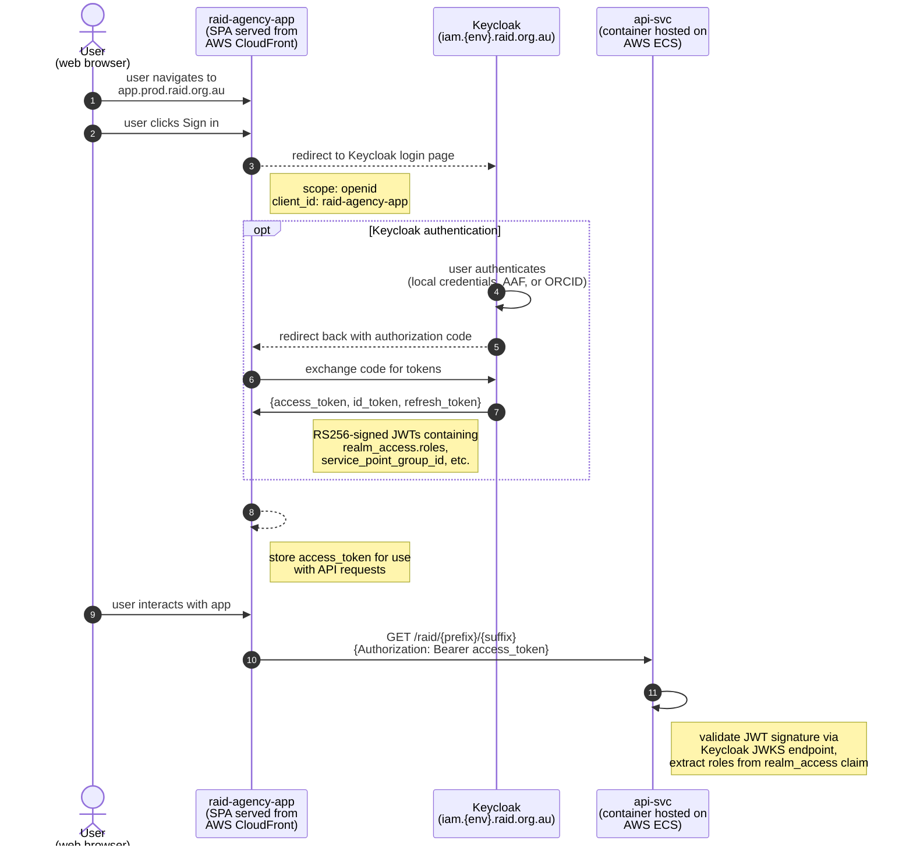
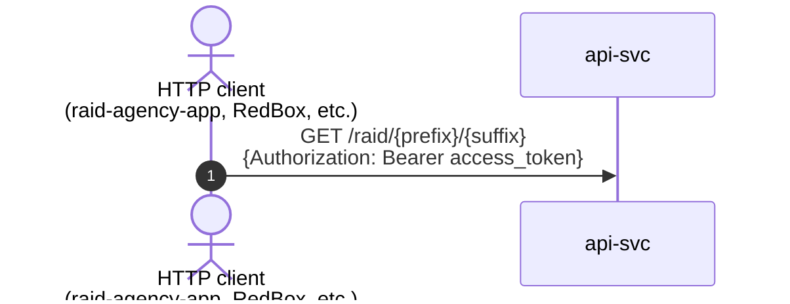

> **Note:** This document has been updated to reflect the current Keycloak-based
> authentication architecture. The previous custom api-token exchange flow
> (where api-svc generated its own HS256 JWTs) has been replaced by standard
> Keycloak OAuth2/OIDC token issuance.

This documents a "happy day" sign-in process for a human user.

Authentication is handled entirely by Keycloak (the Identity and Access
Management server). Users authenticate via Keycloak, which federates to
external identity providers (AAF via SATOSA/SAML, ORCID, etc.).
Keycloak issues standard RS256-signed JWTs.

Assume:
* the user has a Keycloak account (either local or federated via AAF/ORCID)
* the user has been assigned to a service-point group with appropriate roles

---

The Keycloak-issued access token must be included in the `Authorization`
header for every request to an endpoint that requires authorization.

The api-svc validates the JWT using Spring Security's OAuth2 Resource Server
support, which verifies the token signature against Keycloak's JWKS endpoint.
Roles are extracted from the `realm_access.roles` claim in the JWT.

See [spring-security-configuration.md](../authorization/spring-security-configuration.md)
for details of how the security filter chain is configured.