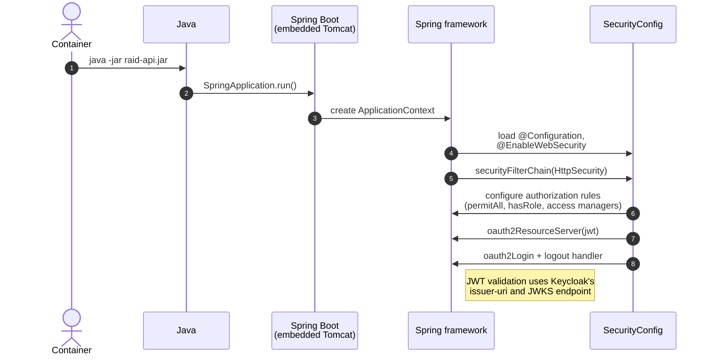

This diagram outlines how the
[SecurityConfig](/api-svc/raid-api/src/main/java/au/org/raid/api/config/SecurityConfig.java)
is bootstrapped by Spring Boot.

The application uses Spring Security's OAuth2 Resource Server support to
validate Keycloak-issued JWTs. There is no custom `AuthenticationProvider`;
instead, a `JwtAuthenticationConverter` bean extracts Keycloak realm roles
from the `realm_access.roles` claim in the JWT.

Authorization decisions are handled by:
* Standard role checks via `hasRole()` / `hasAnyRole()` in the filter chain
* Custom `AuthorizationManager` implementations in
  [RaidAuthorizationService](/api-svc/raid-api/src/main/java/au/org/raid/api/auth/RaidAuthorizationService.java)
  for fine-grained access control (service-point ownership, per-raid permissions)

See [oauth2_api-token_exchange.md](../authentication/oauth2_api-token_exchange.md)
for details about how a user authenticates via Keycloak.

## Key roles used in authorization rules

The following Keycloak realm roles are checked in `SecurityConfig`:

| Role | Purpose |
|------|---------|
| `service-point-user` | Standard user associated with a service point |
| `operator` | System administrator with broad access |
| `raid-admin` | Admin-level access to specific raids |
| `raid-user` | User-level access to specific raids |
| `raid-upgrader` | Access to legacy/upgrade endpoints |
| `raid-dumper` | Access to bulk public data export |
| `pid-searcher` | Access to PID-based search endpoints |
| `contributor-writer` | Access to PATCH contributor data |
| `raid-access-handler` | Access to embargoed raid data |
