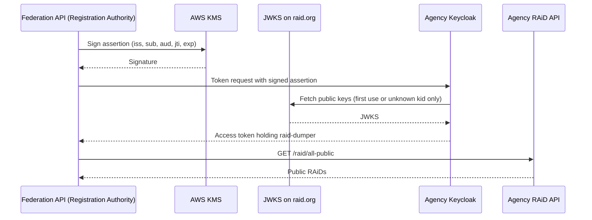

# RAID-836: federation harvest credentials without a shared secret (proposal)

- JIRA: [RAID-836](https://ardc.atlassian.net/browse/RAID-836) (Spike), parent [RAID-739](https://ardc.atlassian.net/browse/RAID-739)
- Related: [RAID-884](https://ardc.atlassian.net/browse/RAID-884) (boot-time provisioning hook), [RAID-827](https://ardc.atlassian.net/browse/RAID-827) (in-process client creation), [RAID-752](https://ardc.atlassian.net/browse/RAID-752) (federation ingest)
- Status: draft for review, 7 October 2026 (evidence gathered 30 September 2026)
- PR: [#706](https://github.com/au-research/raid-au/pull/706)
- Findings: [`20260930-raid-836-ra-credential-spike.md`](./20260930-raid-836-ra-credential-spike.md)
- ADR (proposed): [`2026-09-30_federation-harvest-client-uses-private-key-jwt.md`](../doc/adr/2026-09-30_federation-harvest-client-uses-private-key-jwt.md)
- Evidence: [`iam/probe/private-key-jwt/`](../iam/probe/private-key-jwt/README.md)

Labels used below: **Verified** means shown by the probe, in the test environment, or in source. **Unverified** means an assumption that still needs confirming.

## Terms

The **Registration Authority** is ARDC operating raid.org and the Federation API. It does the harvesting. A **Registration Agency** runs its own RAiD Service, for example RAiD AU, SURF or CRKN. It is harvested. Earlier RAID-836 notes used "RA" for Registration Agency; this document avoids the abbreviation.

## Recommendation

Each Registration Agency's RAiD Service creates its own harvest client automatically at boot. The Registration Authority authenticates to that client with a signed JWT instead of a client secret. No secret ever crosses from an agency to ARDC.

- The client is created by the boot hook already built and verified for RAID-884. It needs no manual step on any platform.
- The Registration Authority signs each token request with a private key held in AWS KMS. Each agency's Keycloak verifies the signature with the Registration Authority's public key, which it fetches from a URL on raid.org.
- The agency's one manual step is sending ARDC its base URL, which is not secret.
- The client holds only the `raid-dumper` role, so the scope is no broader than today's. That role also reads service point records, including contact email addresses; see [Risks and open questions](#9-risks-and-open-questions).

## 1. The problem

The Federation API's ingest handler (`raid-aws-private`, `handler/federation-ingest/src/source/http-agency-source.ts`) gets a client-credentials token from each agency's Keycloak for a client holding `raid-dumper`, then calls `GET /raid/all-public`. It authenticates with a `client_secret` from AWS Secrets Manager. ARDC staff created every agency's client and secret by hand.

For production, the product owner set these constraints on 25 August 2026:

- No manual steps during or after deployment. The credential must come into existence automatically.
- It must work whether the agency runs on AWS, plain Docker, Kubernetes or anything else, with no central ARDC broker.
- The only accepted manual step is the agency sending the credential to ARDC.
- It must be available before the production Federation API is stood up.

With a client secret, that one manual step means a long-lived secret crossing an organisational boundary. It needs a secure intake channel, leaves the secret in two places, and repeats on every rotation.

## 2. Who holds which key

The private key signs and the public key verifies. The request never carries the key it is checked against: if it did, anyone could generate a key pair, sign with it and attach their own public key.

| Party | Holds | Does |
|---|---|---|
| Registration Authority | The **private key**, in AWS KMS, where it cannot be exported | Signs a short-lived assertion for each token request |
| Each Registration Agency | Only the Registration Authority's **public key**, which can be published freely | Keycloak uses it to check each assertion. The agency holds no private key in this scheme. |



## 3. How it works

### At every agency boot

A `PostMigrationEvent` listener in `raid-iam.jar` creates the harvest client in any realm that has a `raid-dumper` role, if the client is missing. This is the mechanism verified for RAID-884: it fires on first boot, again on every restart, and after realm import. The client is configured with:

- a fixed client ID compiled into the jar, so ARDC knows it without being told;
- Keycloak's **Signed JWT** client authenticator (`client-jwt`, the OAuth `private_key_jwt` method in [RFC 7523](https://datatracker.ietf.org/doc/html/rfc7523));
- the Registration Authority's JWKS URL as a compiled-in default, overridable by an environment variable;
- a service account holding only `raid-dumper`.

### At harvest time

The grant is still the ordinary client credentials grant. Only the way the client proves who it is changes:

```
grant_type=client_credentials
client_id=<fixed harvest client ID>
client_assertion_type=urn:ietf:params:oauth:client-assertion-type:jwt-bearer
client_assertion=<JWT signed by KMS: iss = sub = client ID, aud = agency realm issuer, jti, exp>
```

Keycloak handles fetching the JWKS, caching keys, and checking the signature, audience, expiry and replay by itself. The agency writes no code and runs nothing.

## 4. When an agency reads the JWKS

Keycloak reads it lazily, when a token request needs a key it does not have. It does not read it at boot or on a schedule.

| Moment | Fetches the JWKS? | Basis |
|---|---|---|
| Boot, when the hook creates the client | No. The hook only stores the URL. | By design |
| First token request | Yes, then caches the keys in memory | **Verified** |
| Request with a known key ID | No, uses the cache | **Verified** |
| Request with an unknown key ID | Yes, but no more than about once every 10 seconds. The refetch replaces the whole cached key set, so keys no longer in the JWKS are dropped. | **Verified** |
| After a Keycloak restart | Yes, on the next request | Follows from the in-memory cache |
| Cached keys unused for an hour | Dropped, so the next request fetches again. Keycloak 26.6.2 sets `KEYS_CACHE_MAX_IDLE_SECONDS = 3600`. | From Keycloak source; **unverified** by observation |

The JWKS must therefore be reachable at harvest time, not deploy time. An agency that blocks outbound HTTPS deploys cleanly and fails only when ARDC first harvests. The boot hook could make a non-blocking reachability check and log a warning so the agency sees the problem at deploy time.

## 5. Getting the public key to agencies

The public key is not secret, so it needs no confidential channel. It does need an authentic one: whoever controls which key an agency trusts can harvest from that agency.

| Channel | What makes it authentic | Rotation | Use |
|---|---|---|---|
| JWKS fetched from a raid.org URL | raid.org TLS and DNS | ARDC publishes a new key; agencies do nothing | Default |
| Key set embedded in `raid-iam.jar` | The integrity of the release agencies already install | Ship the current and next keys in each release; switch once agencies have upgraded | Fallback for agencies with no outbound access |
| Email or portal for manual paste | Nothing reliable. Open to a convincing fake "new certificate". | Manual | Rejected |

The embedded fallback stores a small JWKS on the client itself (Keycloak's `jwks.string` attribute), so it needs no certificate: the key set is built straight from KMS `GetPublicKey`. The keys are dedicated Registration Authority harvest keys, not raid.org's TLS certificate and not a general-purpose authority key, because every agency trusts them for bulk harvest access.

Publishing the key's fingerprint in agency onboarding documentation lets an agency check its Keycloak trusts the right key if it wants to. It is a check, not a required step.

## 6. Rotating the key

With the JWKS URL, rotation happens entirely on the Registration Authority side, so it does not depend on when agencies deploy. Every agency sees the same published JWKS.

1. Create a new KMS asymmetric signing key. KMS does not rotate asymmetric keys automatically ([AWS documentation](https://docs.aws.amazon.com/kms/latest/developerguide/rotate-keys.html)), so rotation means a new key with a new key ID.
2. Publish the JWKS with both the old and new keys.
3. Wait at least the CDN cache time, so no agency sees the new key ID before the JWKS lists it.
4. Point the signing alias at the new key. The first assertion with the new key ID makes each agency's Keycloak refetch and accept it.
5. After a grace period, remove the old key from the JWKS, disable it in KMS and schedule its deletion.
6. Send each agency one assertion with an unknown key ID. It is rejected, but it makes that agency's Keycloak refetch the JWKS and drop the retired key from its cache. Without this step the retired key drops out after an hour of disuse.

### If the key is compromised

The KMS key cannot be exported, so a compromise means someone gained permission to use it, not a copy of it. Removing that access or disabling the key stops signing at once for every agency.

If key material ever did leave KMS, the Registration Authority can still evict it from every agency without their help: publish a JWKS without it, then send each agency an assertion with an unknown key ID to force the refetch (**verified**). For agencies running several Keycloak nodes, each node keeps its own cache, so the eviction request has to reach every node (**unverified**).

Tokens already issued stay valid until they expire, because the RAiD API validates tokens locally against Keycloak's signing keys rather than asking Keycloak on each call (`SecurityConfig`: `oauth2ResourceServer().jwt()`). The realm default is 24 hours in test. Keycloak honours a lifespan set on a single client (**verified** at 300 seconds), so the harvest client can have a much shorter one without changing the realm.

### Fallback to the previous key

- **JWKS URL:** not needed for correctness, but worth keeping during the grace period. It covers an agency that cannot refetch at the moment the new key ID appears, or whose refetch is rate-limited. Retry with the previous key only on an HTTP 400 `invalid_client` response, never on a timeout or server error. Keycloak returns that code for every key problem the probe tried. A disabled client also returns `invalid_client` (as HTTP 401), where a retry fails harmlessly. Sign a fresh assertion, because a reused one is rejected. Log and alert on every fallback.
- **Embedded key set:** ship the current and next keys in every release. Both are accepted from one client (**verified**), so an agency on any recent release already trusts the next key before a rotation. The retry is still needed for agencies that skipped releases, and the Registration Authority should track which agencies still need the old key before retiring it.
- **Initial rollout:** agencies that have not yet deployed the boot-hook release have no signed-JWT client. Each agency's configuration should state which method to use. The demo agencies (ARDC and SDSC) stay on `client_secret` until they upgrade. Do not fall back from JWT to a secret automatically, or the legacy path will never be removed.

## 7. Registration Authority infrastructure on AWS

AWS has no single managed service that rotates a signing key and publishes a JWKS, but its parts fit together well. All of this is on the Registration Authority side; agencies need nothing from AWS.

| Need | AWS tool | Notes |
|---|---|---|
| Hold the private key and sign | KMS asymmetric key, [`Sign`](https://docs.aws.amazon.com/kms/latest/APIReference/API_Sign.html) | Use `RSASSA_PKCS1_V1_5_SHA_256` (RS256), as tested |
| Publish the public key | KMS `GetPublicKey` | Returns SPKI DER, the source for the JWKS entry and the key ID |
| Stable name across rotations | KMS alias | The handler signs through the alias; rotation is an `UpdateAlias` |
| Schedule and sequence rotation | EventBridge Scheduler with Step Functions | Step Functions suits ordered steps with waits |
| Serve the JWKS | S3 and CloudFront | Static `jwks.json`; public, cheap and highly available |
| Retire or revoke | KMS `DisableKey`, `ScheduleKeyDeletion` | Disabling is immediate; deletion waits 7 to 30 days |

- ECDSA signatures from KMS are DER-encoded, but JWT ES256 needs the raw form. RS256 avoids the conversion.
- Neither mode needs a certificate, so there is no certificate to generate or sign with KMS.
- Cloudflare is authoritative for raid.org, so the JWKS hostname's DNS record goes there, not in the Route53 mirror.
- Everything is defined in CDK in `raid-aws-private`.

## 8. Evidence

### Isolated Keycloak 26.6.2 container probe

Run on 30 September 2026 with `iam/probe/private-key-jwt/run-probe.sh`, which can be re-run on any Keycloak upgrade. Twenty-three checks passed as expected and one is recorded as an observation.

| Check | Result |
|---|---|
| Token issued; audience may be the realm issuer or the token endpoint | Works |
| Token holds `raid-dumper` and not an unrelated role in the same realm | Works |
| Replayed assertion, unknown key, forged key ID, expired assertion, wrong audience | Rejected |
| Client secret, or no client authentication | Rejected |
| New key added to the JWKS picked up without a restart | Works |
| Key removed from the JWKS, before any refetch | Still accepted from cache |
| Same key after an unknown-key-ID request forces a refetch | Rejected |
| Two keys held on one client with no URL (`jwks.string`) | Both accepted |
| Embedded certificate, with no key ID or a thumbprint key ID | Works |
| Access token lifespan of 300 seconds set on one client | Honoured |
| Error code for every rejected key | HTTP 400 `invalid_client` |
| Disabled client | Rejected at once |

### Test environment

A spike client, `raid-836-signed-jwt-probe`, was created in the `raid` realm at `iam.test.raid.org.au` with an embedded certificate. It obtained a token holding `raid-dumper` and the realm's default Keycloak roles only, and `GET /raid/all-public` on `api.test.raid.org.au` returned HTTP 200 with 2029 RAiDs. The client was made by hand for the spike, not by the boot-hook mechanism, and was deleted from test on 30 September 2026 once the result was recorded.

## 9. Risks and open questions

Most items raised during the spike are answered by the extended probe or by reading the code.

| Item | Status | Finding or next step |
|---|---|---|
| Revocation lag: a removed key stays cached | Answered | The Registration Authority can force eviction itself with one unknown-key-ID request (**verified**). Otherwise the key drops after an hour of disuse. |
| Error code the fallback rule depends on | Answered | HTTP 400 `invalid_client` for every key failure. The description text varies and should not be relied on. |
| Several keys on one client, for the embedded fallback | Answered | Works with `jwks.string`. Ship current and next keys in each release. |
| How long a leaked access token stays usable | Answered | Until it expires: the API validates tokens locally. Set a short lifespan on the harvest client; per-client lifespans work. |
| Can `/raid/all-public` return embargoed records? | Answered | No. It returns open-access records only (`RaidRepository.findAllPublic`). Embargoed records come from `/raid/all-embargoed`, which needs `raid-access-handler`. `raid-dumper` is also outside every rule for reading individual RAiDs. |
| `raid-dumper` also grants `GET /service-point/**` | New finding | Service point records include admin and technical contact email addresses, so a compromised harvest key would expose them as well as public RAiDs. The harvester does not need this. Raise as a separate ticket. |
| Dormant secret on Signed JWT clients | Likely avoidable | Created by the Admin REST API. The model-layer `addClient()` path used by RAID-827 generates a secret only when asked to, so the boot hook should have none. Assert this in its integration test. |
| Model-layer traps from RAID-827 (`fullScopeAllowed`, default client scopes) | Known trap | Set both; the integration test asserts on a real token. |
| Multi-node agencies: forced eviction reaches one node per request | **Unverified** | Test against a two-node Keycloak in the implementation ticket. |
| API roles in an agency's default role composite | Checked in test only | Test's default composite holds only Keycloak's defaults. Note it in agency guidance. |
| Whether ARDC Services has an approved mechanism for receiving secrets from external parties | Needs ARDC Services | Only relevant if a secret-based path is kept. Needs a person to ask. |

## 10. Proposed follow-up work

Suggested order: publish the keys, ship the client, then switch the harvester.

1. **Registration Authority keys** (`raid-aws-private`): KMS signing key and alias, JWKS on S3 and CloudFront, rotation workflow.
2. **IAM boot hook** (`raid-au/iam`): create the harvest client with Signed JWT, the default JWKS URL and override, the embedded key set as fallback, a short token lifespan, `fullScopeAllowed`, default client scopes and no secret. Reconcile managed attributes on every boot. Integration test on a real token, including a two-node eviction check.
3. **Ingest handler** (`raid-aws-private`): sign assertions through KMS, choose the method per agency, add the narrow fallback during the grace period, and add the forced-eviction step to rotation.
4. **Revocation and guidance:** write the runbook (Registration Authority eviction, and the agency disabling its client as a last resort) and publish the key fingerprint for agencies.
5. **Separate ticket:** review whether `raid-dumper` should keep `GET /service-point/**`, which exposes contact email addresses.

## References

- [RFC 7523](https://datatracker.ietf.org/doc/html/rfc7523), JWT profile for OAuth 2.0 client authentication
- [AWS KMS `Sign`](https://docs.aws.amazon.com/kms/latest/APIReference/API_Sign.html) and [AWS KMS key rotation](https://docs.aws.amazon.com/kms/latest/developerguide/rotate-keys.html)
- [`doc/adr/2026-09-11_boot-time-role-provisioning-via-postmigrationevent.md`](../doc/adr/2026-09-11_boot-time-role-provisioning-via-postmigrationevent.md)
