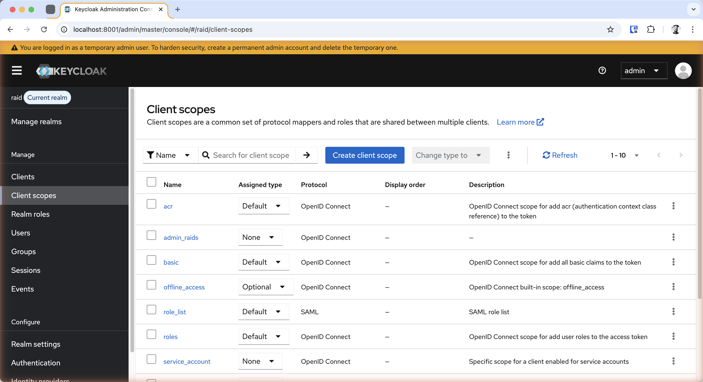
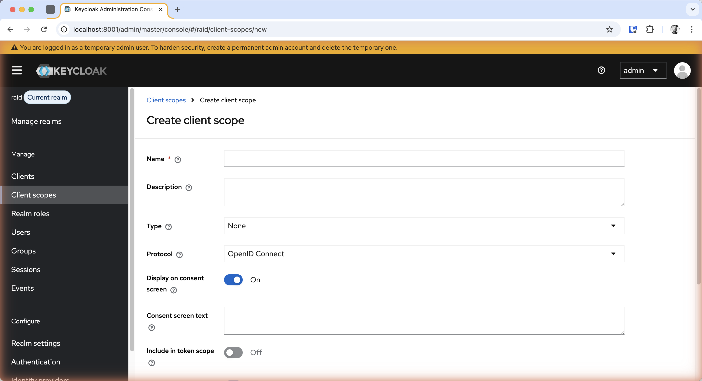
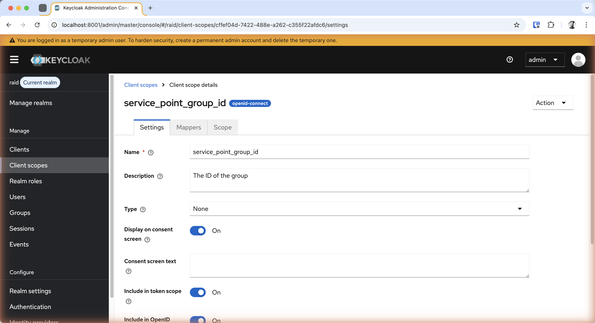
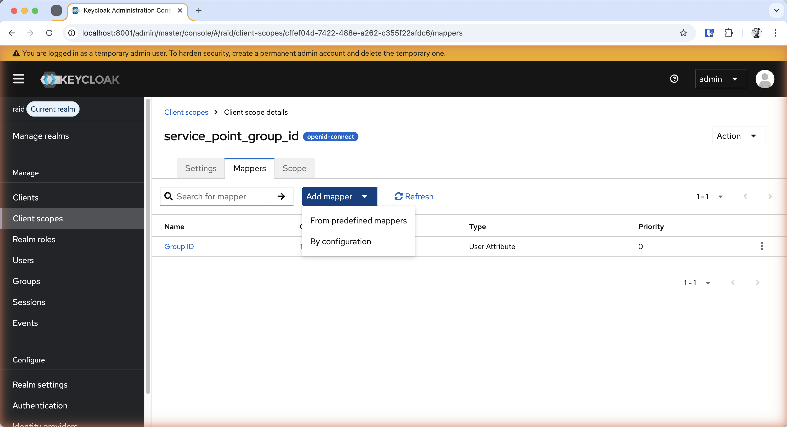
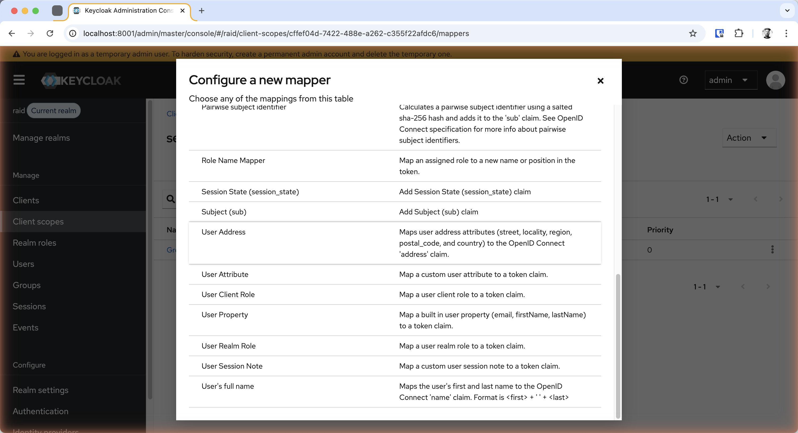
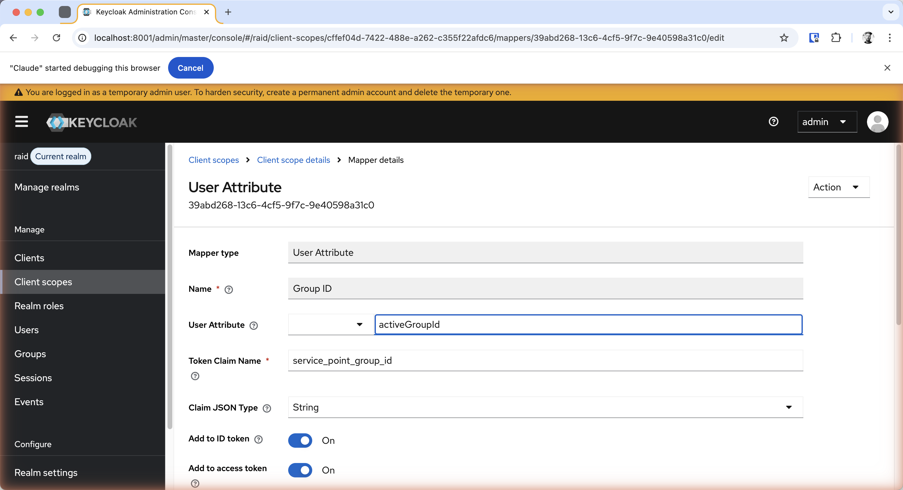
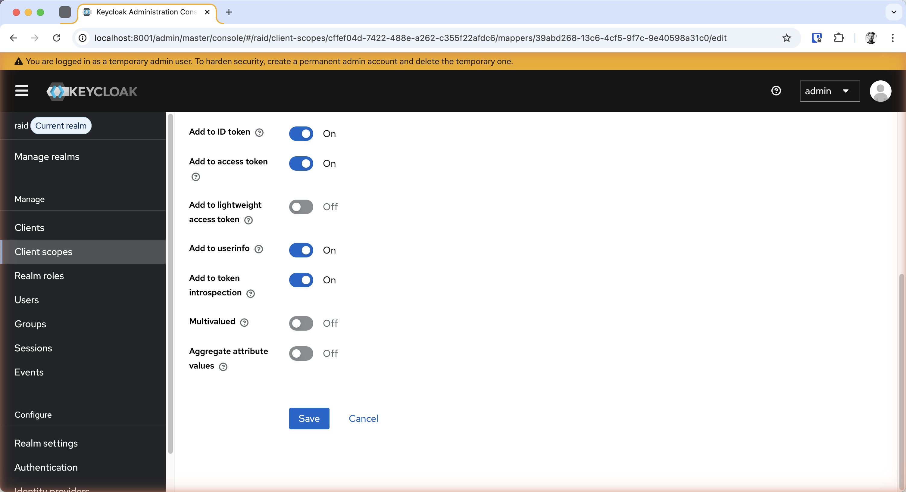
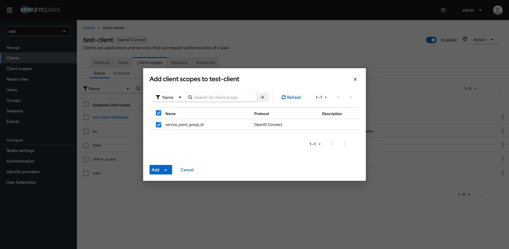
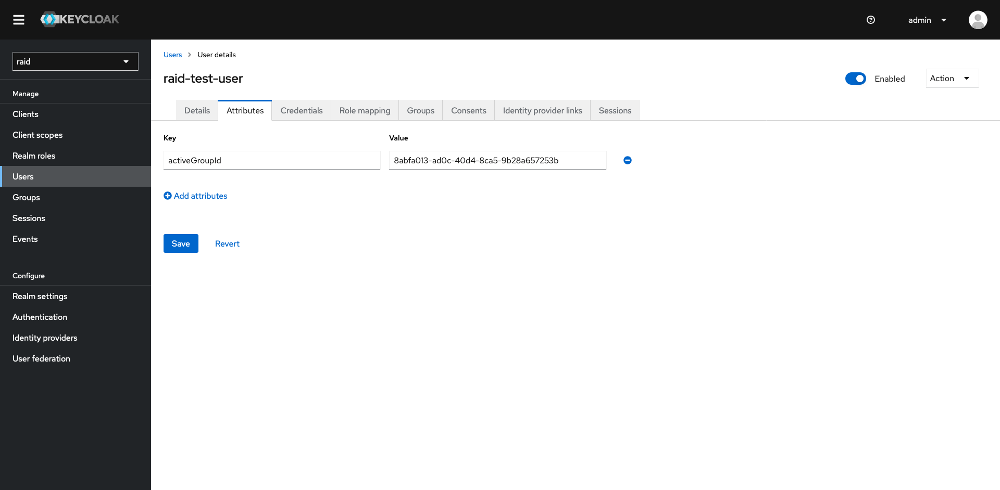

# Mapping `activeGroupId` to `service_point_group_id` Token Claim

This guide demonstrates how to configure Keycloak to map the `activeGroupId` user attribute to the `service_point_group_id` JWT token claim. The RAiD API uses this claim to resolve the user's service point when minting or listing RAiDs.

## Background

The RAiD API reads the `service_point_group_id` claim from the access token to determine which service point a user belongs to. If this claim is missing or does not match an existing service point, the API returns a `403 Service point not found` error.

The mapping works as follows:

```
User attribute: activeGroupId  →  Token claim: service_point_group_id  →  API: ServicePointService.findByGroupId()
```

## Prerequisites

- Access to the Keycloak admin console (e.g. `http://localhost:8001/admin`)
- Admin privileges on the target realm (e.g. `raid`)
- A Keycloak group with a `groupId` attribute (see [service-point-group-id.md](service-point-group-id.md) for group setup)

## Step 1: Create the Client Scope

1. In the Keycloak admin console, select the **raid** realm
2. Navigate to **Client scopes** in the left sidebar
3. Click the **Create client scope** button



4. Fill in the form:
   - **Name**: `service_point_group_id`
   - **Description**: (optional) e.g. "Maps the user's active group ID to a token claim for RAiD service point resolution"
   - **Type**: `None`
   - **Protocol**: `OpenID Connect`
5. Click **Save**



## Step 2: Add a User Attribute Mapper

After saving the client scope, you will be taken to the scope detail page.

1. Click the **Mappers** tab



2. Click the **Add mapper** dropdown and select **By configuration**



3. In the "Configure a new mapper" dialog, scroll down and select **User Attribute**



4. Configure the mapper with these values:

| Field | Value |
|---|---|
| **Name** | `Group ID` (or any descriptive name) |
| **User Attribute** | `activeGroupId` |
| **Token Claim Name** | `service_point_group_id` |
| **Claim JSON Type** | `String` |
| **Add to ID token** | `On` |
| **Add to access token** | `On` |
| **Add to userinfo** | `On` |
| **Add to token introspection** | `On` |




5. Click **Save**

## Step 3: Add the Client Scope to Your Client

1. Navigate to **Clients** and select the client that your application uses (e.g. `raid`)
2. Go to the **Client scopes** tab
3. Click **Add client scope**
4. Select `service_point_group_id` and click **Add** (as Default or Optional)



## Step 4: Set the User's `activeGroupId` Attribute

Each user who needs to mint RAiDs must have the `activeGroupId` attribute set to the UUID of their Keycloak group.

1. Navigate to **Users** and select the user
2. Go to the **Attributes** tab
3. Add an attribute with key `activeGroupId` and value set to the group's UUID



## Verification

Request a token and decode it (e.g. at [jwt.io](https://jwt.io)). You should see the `service_point_group_id` claim in both the access token and ID token:

```json
{
  "service_point_group_id": "8abfa013-ad0c-40d4-8ca5-9b28a657253b",
  ...
}
```


## Troubleshooting

| Symptom | Cause | Fix |
|---|---|---|
| `403 Service point not found` with `"No service point exists for group null"` | `service_point_group_id` claim is missing from the token | Ensure the client scope is added to the client AND the user has the `activeGroupId` attribute set |
| `403 Service point not found` with a valid UUID | The `activeGroupId` value doesn't match any service point's `groupId` | Verify the service point exists with a matching `groupId` in the `service_point` table |
| Claim not appearing in token | Client scope not assigned to the client, or mapper misconfigured | Check that the scope is listed under the client's "Client scopes" tab and the mapper has "Add to access token" enabled |

## Related

- [service-point-group-id.md](service-point-group-id.md) — Full setup guide including group creation, user assignment, and service point creation
- `RaidController.java` — `getServicePointId()` method reads the `service_point_group_id` claim
- `ServicePointNotFoundException.java` — Exception thrown when the claim is missing or doesn't match a service point
