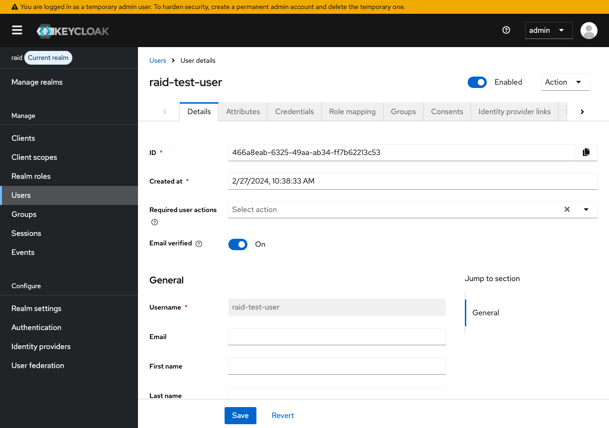
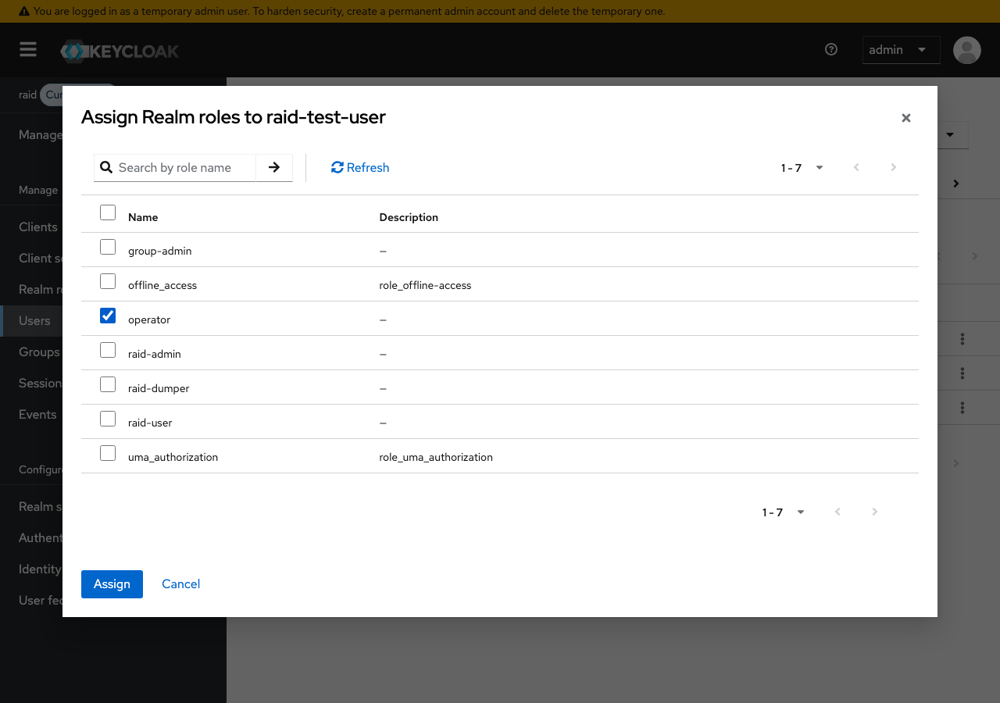

# Adding a Role to a User

This guide explains how to assign a realm role to a user in the Keycloak admin console.

## Prerequisites

- Access to the Keycloak admin console at [http://localhost:8001/admin/master/console/](http://localhost:8001/admin/master/console/)
- Admin credentials (`admin` / `admin` in local dev)
- The **raid** realm selected (see [Keycloak Configuration](keycloak-configuration.md) for realm details)

## Steps

### 1. Navigate to the Users page

From the **raid** realm, click **Users** in the left sidebar. You will see a list of all users in the realm.

Click **View all users** if the list is not already populated, then click the username of the user you want to modify (e.g. `raid-test-user`).

### 2. Open the user details

You will see the user's details page with tabs for **Details**, **Attributes**, **Credentials**, **Role mapping**, **Groups**, **Consents**, and **Sessions**.

### 3. Go to the Role mapping tab

Click the **Role mapping** tab to see the roles currently assigned to the user.

This shows the user's current role assignments. In the example above, `raid-test-user` has `pid-searcher`, `service-point-user`, and `default-roles-raid`.

### 4. Assign a new role

Click the **Assign role** dropdown and select **Realm roles** to open the role assignment dialog.

The dialog lists all available realm roles that are not yet assigned to the user.

### 5. Select the role

Check the checkbox next to the role you want to assign (e.g. `operator`).

### 6. Confirm the assignment

Click the **Assign** button in the dialog. You will see a success message confirming the role has been assigned.

The new role now appears in the user's role mapping list.

## Available Realm Roles

| Role                  | Description                                                       |
|-----------------------|-------------------------------------------------------------------|
| `service-point-user`  | Can mint and manage RAiDs within their service point group         |
| `group-admin`         | Can manage members and settings of their service point group       |
| `operator`            | System operator with cross-group administrative access             |
| `raid-user`           | Basic RAiD access role                                            |
| `raid-admin`          | Administrative RAiD access role                                   |
| `raid-dumper`         | Permission to perform bulk data export                            |
| `pid-searcher`        | Permission to search PIDs                                         |

See [Role Permissions](role-permissions.md) for a detailed breakdown of what each role can do.

## Removing a Role

To remove a role from a user:

1. Go to the user's **Role mapping** tab
2. Check the checkbox next to the role you want to remove
3. Click **Unassign**
4. Confirm the removal in the dialog
