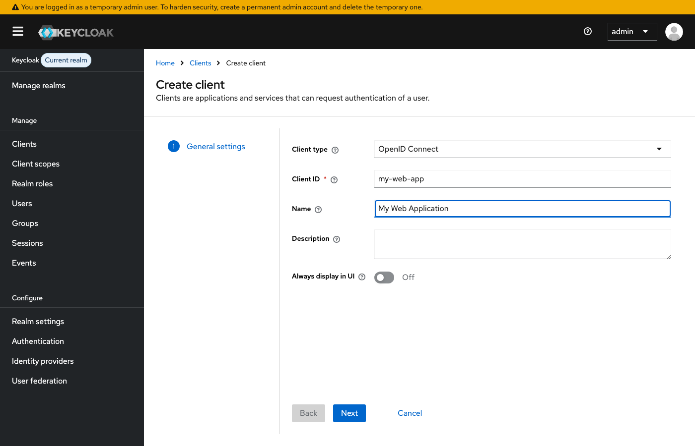
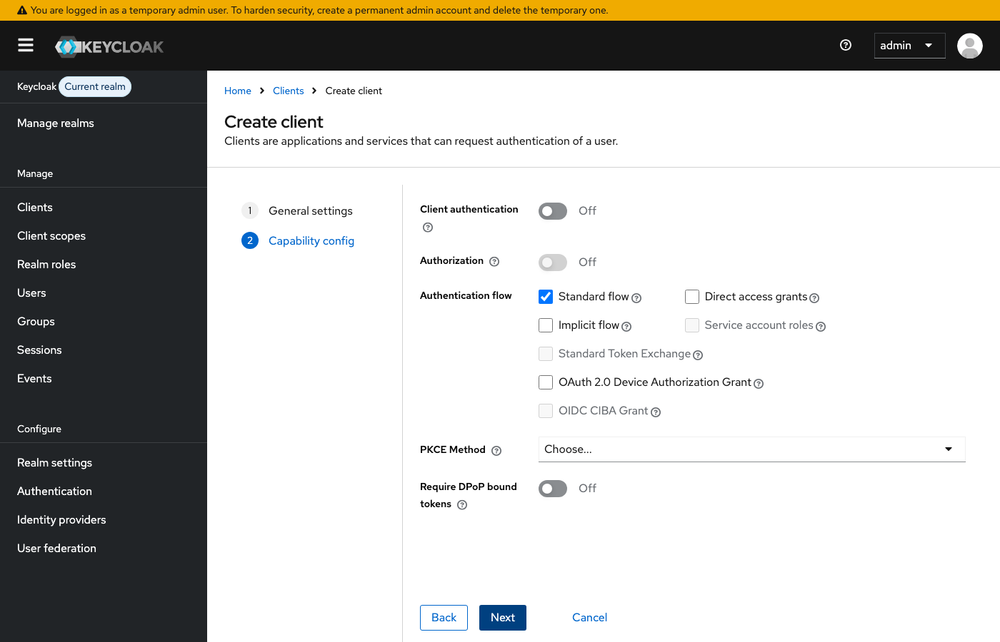
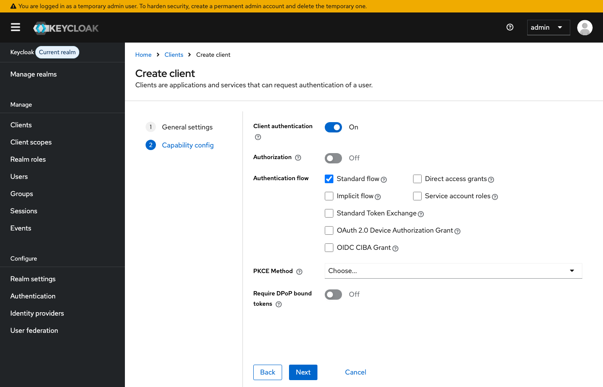
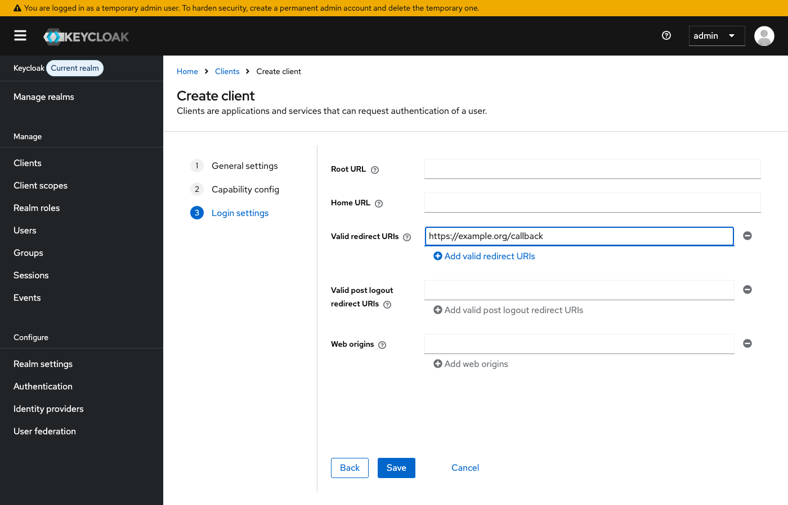
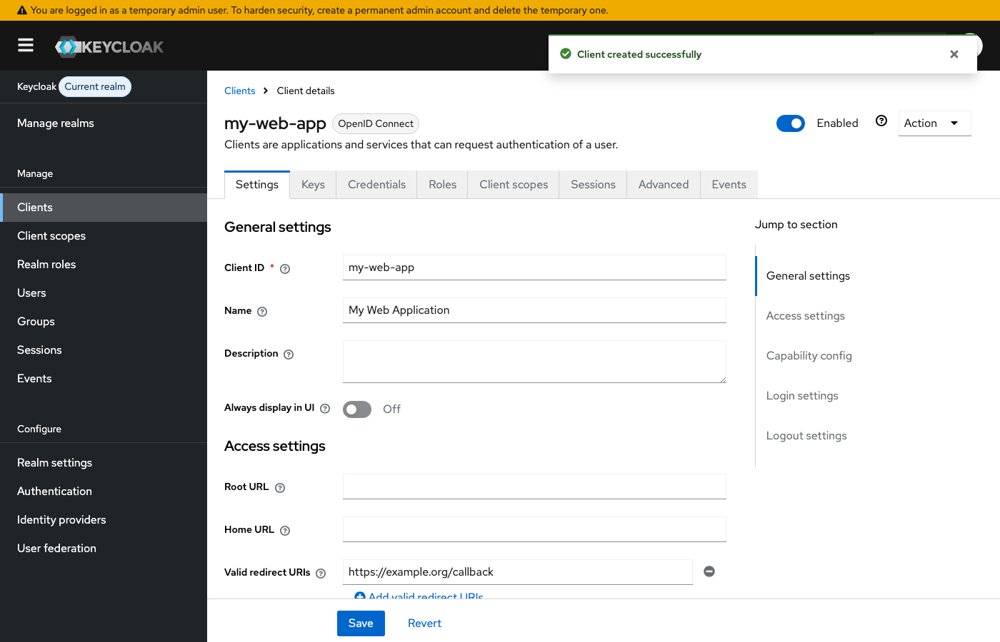
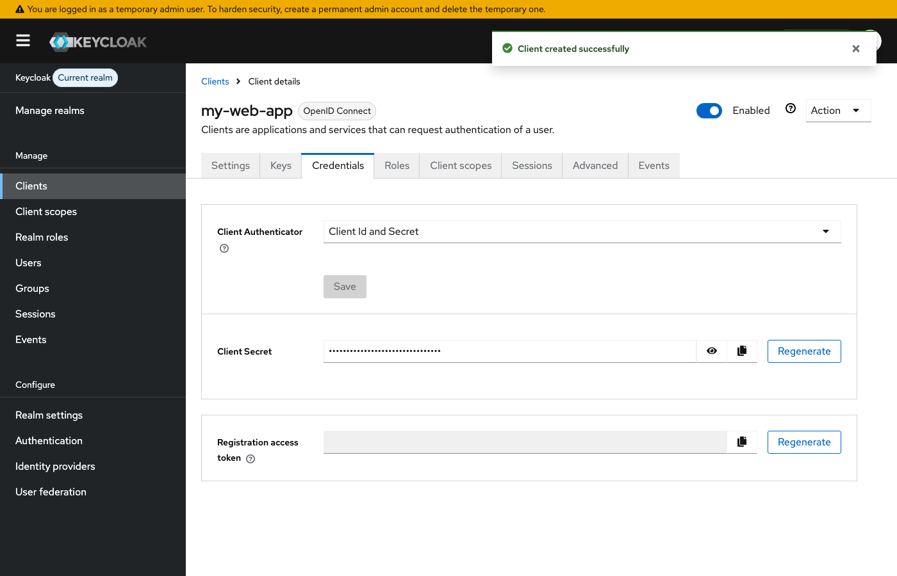

# Creating a Confidential Client for Authorization Code Flow

This guide walks through creating a **confidential** OpenID Connect client in Keycloak for the OAuth2 Authorization Code flow. This is used when the external client operates a server-side web application that can securely store a `client_secret` on its backend.

For browser-based applications (single-page apps) that cannot securely store a secret, see [authorization-code-flow-public-client.md](authorization-code-flow-public-client.md) instead.

For details on how to use the authorization code flow once a client is created, see [authorization-code-flow.md](authorization-code-flow.md).

## Prerequisites

- Admin access to the Keycloak administration console
- Access to the `raid` realm
- The redirect URI(s) for the external client's application

## 1. Navigate to the Clients page

Log in to the Keycloak admin console and select the **raid** realm. Click **Clients** in the left sidebar to view the list of existing clients.

Click the **Create client** button.

## 2. Configure General Settings

On the **General settings** step:

1. **Client type** should be set to `OpenID Connect` (the default)
2. Enter a **Client ID** — this is the identifier the external client will use to authenticate (e.g. `my-web-app`)
3. Optionally add a **Name** and **Description** to document the client's purpose

Click **Next** to continue.

## 3. Configure Capability Config

On the **Capability config** step, you need to configure one setting:

1. **Client authentication** — toggle this to **On**. This makes the client "confidential", meaning it will be assigned a `client_secret` that the external client must store securely on their server.

The **Standard flow** checkbox should already be checked by default — this enables the OAuth2 Authorization Code grant type.

Leave **Service account roles** unchecked — that option is for machine-to-machine authentication (Client Credentials flow) and is not needed here.

After toggling **Client authentication** to **On**:

Click **Next** to continue.

## 4. Login Settings

The **Login settings** step is where you configure the redirect URIs that Keycloak is allowed to redirect to after authentication.

1. **Valid redirect URIs** — enter the URI(s) provided by the external client where their application will receive the authorization code callback. For example, `https://example.org/callback`. You can add multiple URIs by clicking **Add valid redirect URIs**. Wildcards are supported (e.g. `https://example.org/*`) but should be avoided in production for security reasons.

2. **Valid post logout redirect URIs** — optionally enter the URI(s) where Keycloak can redirect after the user logs out.

3. **Web origins** — optionally enter the allowed CORS origins for browser-based requests. You can enter `+` to allow all origins that match the valid redirect URIs.

Click **Save** to create the client.

## 5. Client created

After saving, you will be taken to the client details page. A success banner confirms the client was created.

## 6. Retrieve the Client Secret

Click the **Credentials** tab to view the client secret.

On this tab you can see:

- **Client Authenticator** is set to `Client Id and Secret`
- **Client Secret** is displayed (masked by default — click the eye icon to reveal it, or the copy icon to copy it to your clipboard)
- The **Regenerate** button allows you to generate a new secret if the current one is compromised

Copy the **Client Secret** value to provide to the external client along with the **Client ID**.

## 7. Provide credentials to the external client

The external client will need the following values to integrate with the RAiD API:

| Parameter | Value |
|-----------|-------|
| `client_id` | The Client ID you entered (e.g. `my-web-app`) |
| `client_secret` | The secret from the Credentials tab |
| `redirect_uri` | One of the Valid redirect URIs you configured |
| Authorization endpoint | `https://iam.prod.raid.org.au/realms/raid/protocol/openid-connect/auth` |
| Token endpoint | `https://iam.prod.raid.org.au/realms/raid/protocol/openid-connect/token` |

Replace `iam.prod.raid.org.au` with `iam.demo.raid.org.au` for the DEMO environment.

For details on how to use these credentials, see [authorization-code-flow.md](authorization-code-flow.md).

## Which client type should I create?

When configuring a client for an external party, choose the type that matches their application architecture:

**Create a confidential client** (this guide) when the external client:

- Operates a server-side web application (e.g. Spring Boot, Django, Rails) that can securely store a `client_secret` on its backend
- Exchanges the authorization code for tokens on the server side, not in the browser

**Create a [public client](authorization-code-flow-public-client.md)** when the external client:

- Operates a browser-based single-page application (SPA) that cannot securely store a secret
- Uses a JavaScript framework (e.g. React, Angular, Vue) that runs entirely in the browser
- Will use PKCE (Proof Key for Code Exchange) instead of a client secret

**Create a [Client Credentials client](client-credentials-flow.md)** when the external client:

- Runs an automated service or script that calls the RAiD API without user interaction
- Authenticates as the application itself rather than on behalf of individual users

### Comparison

| | Confidential (Auth Code) | Public (Auth Code + PKCE) | Client Credentials |
|---|---|---|---|
| **Use case** | Server-side web applications | Browser-based SPAs | Machine-to-machine |
| **Client authentication** | On (has `client_secret`) | Off (no secret) | On (has `client_secret`) |
| **Security mechanism** | Client secret | PKCE | Client secret |
| **User login** | Yes | Yes | No |
| **Redirect URIs** | Required | Required | Not required |
| **Token represents** | A specific user | A specific user | The application itself |
