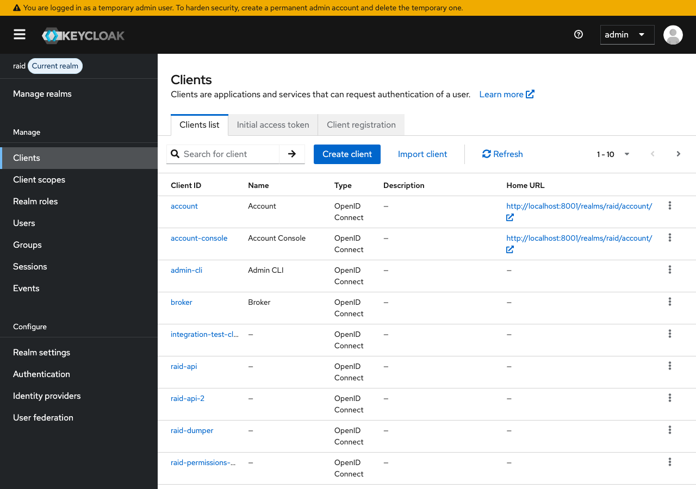
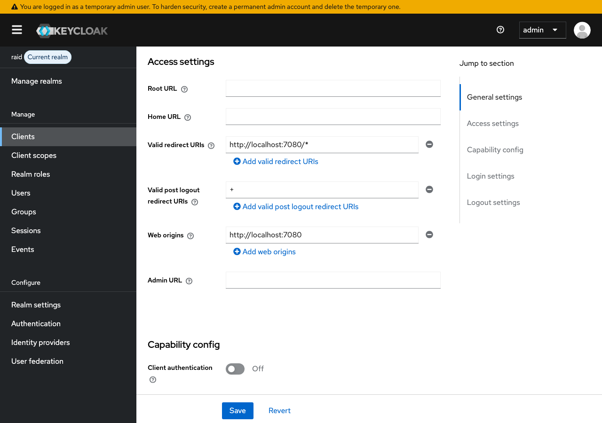

# CORS Configuration

This guide explains what CORS is, why it matters, and how to configure it for a Keycloak client.

## What is CORS?

**CORS** (Cross-Origin Resource Sharing) is a browser security mechanism that controls which websites can make requests to a server.

By default, web browsers block a page on one domain (e.g. `http://localhost:7080`) from making requests to a different domain (e.g. `http://localhost:8001`). This is called the **same-origin policy** and it exists to prevent malicious websites from making requests to other services on your behalf — for example, a phishing site silently calling your bank's API using your logged-in session.

However, legitimate applications often *need* to make cross-origin requests. The RAiD frontend at `http://localhost:7080` needs to talk to Keycloak at `http://localhost:8001` to handle login, token refresh, and logout. Without CORS configuration, the browser would block all of these requests.

CORS works through HTTP headers. When a browser makes a cross-origin request, the server responds with headers like `Access-Control-Allow-Origin` that tell the browser whether the request is permitted. If the server doesn't include the right headers, the browser rejects the response.

### Why this matters for Keycloak

Keycloak is an authentication server. Browser-based applications (SPAs) need to make requests to Keycloak for:

- Redirecting users to the login page
- Exchanging authorization codes for tokens
- Refreshing expired tokens
- Logging users out

All of these are cross-origin requests when the application runs on a different host or port than Keycloak. The **Web origins** setting in Keycloak tells it which origins to include in CORS response headers.

## Configuring CORS for a Client

### 1. Navigate to the client

From the **raid** realm, click **Clients** in the left sidebar.

Click the client you want to configure (e.g. `raid-api`).

### 2. Find the Access settings section

On the client's **Settings** tab, scroll down to the **Access settings** section. This contains the fields relevant to CORS:

### 3. Configure Web origins

The **Web origins** field is where CORS is configured. Scroll down until you see it below the redirect URI fields.

Enter the origin(s) that should be allowed to make cross-origin requests to Keycloak. An origin is the scheme + host + port of the application — for example, `http://localhost:7080`.

| Field             | Purpose                                                                 | Example                    |
|-------------------|-------------------------------------------------------------------------|----------------------------|
| **Web origins**   | Origins allowed to make CORS requests to Keycloak                       | `http://localhost:7080`    |
| **Valid redirect URIs** | URLs Keycloak will redirect to after login (related but separate) | `http://localhost:7080/*`  |

Click **Save** at the bottom of the page after making changes.

### Web origins values

| Value           | Meaning                                                                                     |
|-----------------|---------------------------------------------------------------------------------------------|
| `+`             | All origins derived from the **Valid redirect URIs** are permitted (convenient shorthand)    |
| Specific origin | Only the listed origin is permitted, e.g. `http://localhost:7080`                           |
| `*`             | All origins are permitted (**not recommended** — disables CORS protection entirely)         |

### How it works at the RAiD project

The `raid-api` client (used by the React frontend) is configured with:

| Setting              | Value                     |
|----------------------|---------------------------|
| Valid redirect URIs  | `http://localhost:7080/*` |
| Web origins          | `http://localhost:7080`   |

This means the browser will allow the frontend at `http://localhost:7080` to make requests to Keycloak at `http://localhost:8001`. Requests from any other origin (e.g. a different port or domain) will be blocked by the browser.

In deployed environments, these values are updated to match the production domain (e.g. `https://app.raid.org.au`).

## Common issues

### "CORS error" or "blocked by CORS policy" in the browser console

This means the browser is blocking a request because Keycloak isn't returning the correct CORS headers. Check that:

1. The **Web origins** field includes the exact origin of your application (scheme + host + port)
2. You clicked **Save** after making changes
3. The origin matches exactly — `http://localhost:7080` and `http://localhost:7080/` are different

### Token refresh fails silently

If login works but the application stops working after the access token expires, the token refresh request may be failing due to CORS. The initial login uses a redirect (not affected by CORS), but token refresh is an AJAX request from the browser and requires correct Web origins.

### Works in Postman/curl but not in the browser

CORS is a **browser-only** mechanism. Tools like Postman and curl don't enforce CORS, so they will always succeed regardless of the Web origins setting. If a request works in Postman but fails in the browser, it's almost certainly a CORS issue.
