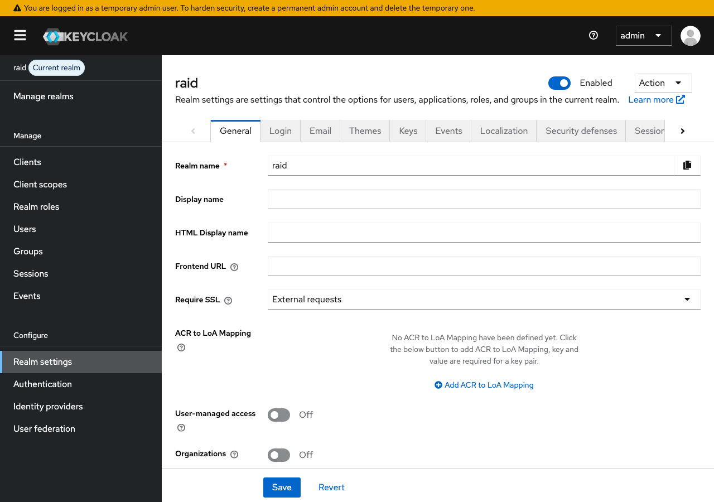
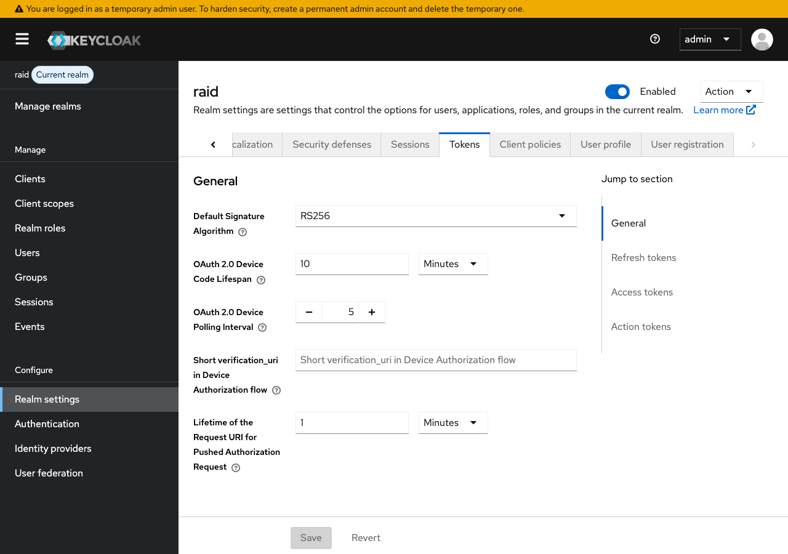
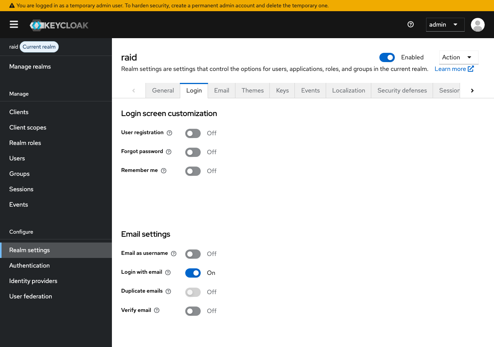
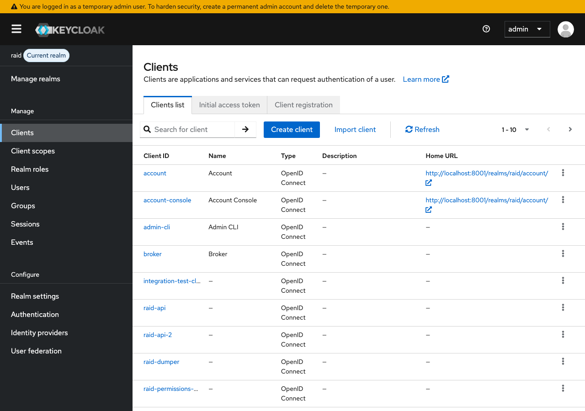
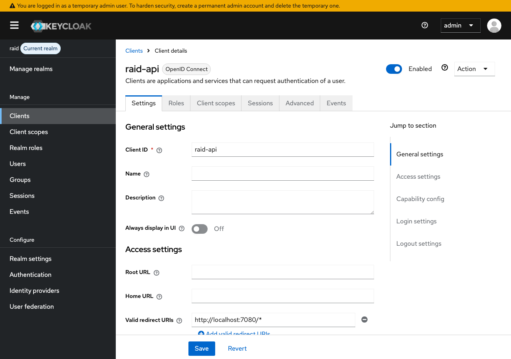
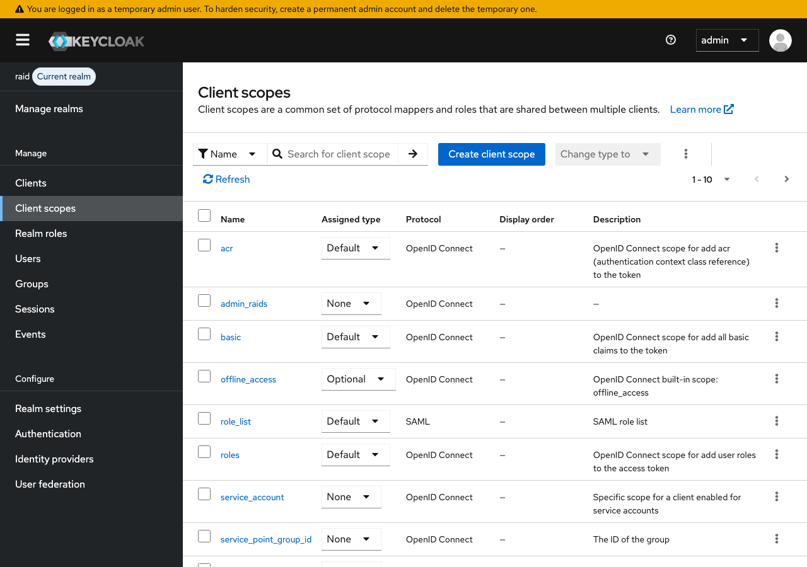
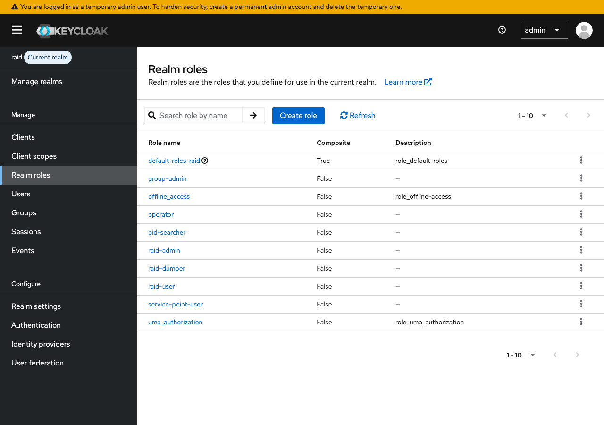
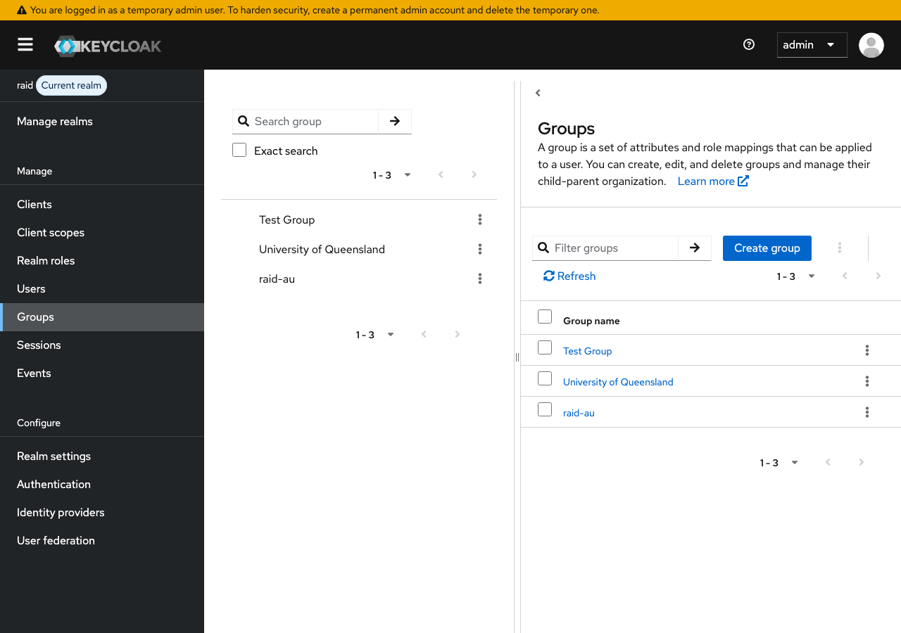
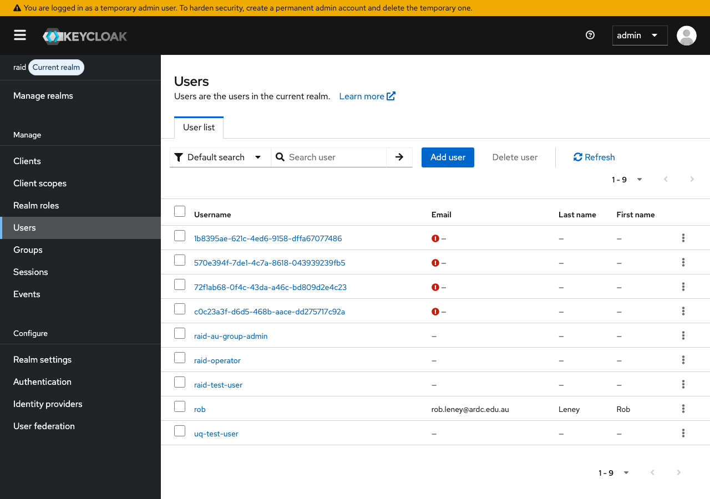
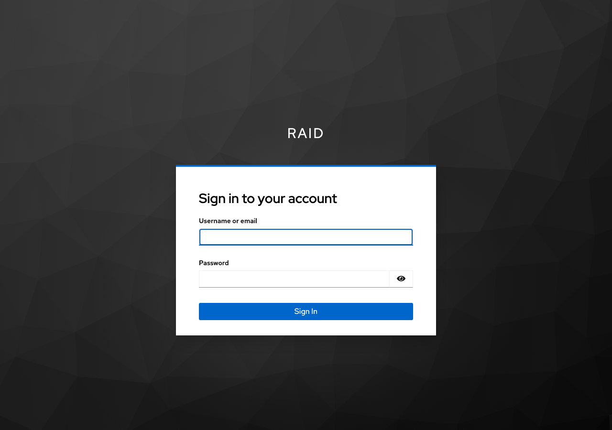

# Keycloak Configuration

This document describes the configuration of the `raid` Keycloak realm used by the RAiD Registration Agency. It covers clients, client scopes, roles, groups, users, and token settings as configured in the local development environment.

The local Keycloak instance runs **Keycloak 26.5.5** on **Java 21**.

## Admin Console

The admin console is available at [http://localhost:8001/admin/master/console/](http://localhost:8001/admin/master/console/) with credentials `admin` / `admin`. After logging in, switch to the **raid** realm via **Manage realms** in the sidebar.

## Realm Settings

| Setting                    | Value              |
|----------------------------|--------------------|
| Realm name                 | `raid`             |
| Enabled                    | Yes                |
| Registration allowed       | No                 |
| Login with email           | Yes                |
| Duplicate emails allowed   | No                 |
| Reset password             | No                 |
| Brute force protection     | No                 |
| SSL required               | External requests  |
| User-managed access        | Off                |

### Token Lifespans

| Token                       | Lifespan    |
|-----------------------------|-------------|
| Access token                | 24 hours    |
| SSO session idle            | 24 hours    |
| SSO session max             | 2 hours     |
| Offline session idle        | 30 days     |
| Access code                 | 60 seconds  |
| Action token (admin)        | 12 hours    |
| Action token (user)         | 5 minutes   |

### Login Settings

### Themes

Two custom login themes are available (defined in `iam/themes/`):

- **ardc-branding** — ARDC-branded login page with combined logos
- **raid-custom** — RAiD-branded login page

No custom theme is set at the realm level in local dev (uses Keycloak default). Deployed environments use the custom themes.

## Clients

### raid-api (Public Client)

The primary client used by the **raid-agency-app** React frontend. Uses the Authorization Code flow with PKCE.

| Setting                      | Value                      |
|------------------------------|----------------------------|
| Client type                  | OpenID Connect             |
| Public client                | Yes                        |
| Standard flow                | Yes                        |
| Direct access grants         | Yes                        |
| Service accounts             | No                         |
| Valid redirect URIs           | `http://localhost:7080/*`  |
| Web origins                  | `http://localhost:7080`    |

**Default client scopes**: `web-origins`, `acr`, `roles`, `user_raids`, `basic`, `admin_raids`, `service_point_group_id`

This client includes all the custom scopes needed for the application — `service_point_group_id`, `user_raids`, and `admin_raids` — which inject user attributes into the access token.

### raid-api-2 (Confidential Client)

A confidential client for server-side authorization code flow integrations.

| Setting                      | Value        |
|------------------------------|--------------|
| Public client                | No           |
| Standard flow                | Yes          |
| Direct access grants         | Yes          |
| Service accounts             | No           |
| Valid redirect URIs           | `/*`         |
| Default client scopes        | `acr`, `roles`, `basic` |
| Optional client scopes       | `offline_access` |

### integration-test-client (Confidential + Service Account)

Used by the integration test suite to authenticate via client credentials.

| Setting                      | Value        |
|------------------------------|--------------|
| Public client                | No           |
| Standard flow                | Yes          |
| Direct access grants         | Yes          |
| Service accounts             | Yes          |
| Valid redirect URIs           | `/*`         |

### raid-dumper (Confidential + Service Account)

Machine-to-machine client for bulk data export operations.

| Setting                      | Value        |
|------------------------------|--------------|
| Public client                | No           |
| Service accounts             | Yes          |
| Default client scopes        | `acr`, `roles`, `basic` |

### raid-permissions-admin (Confidential + Service Account)

Used by the API backend to manage per-RAiD permissions in Keycloak via the custom SPI endpoints.

| Setting                      | Value        |
|------------------------------|--------------|
| Public client                | No           |
| Service accounts             | Yes          |
| Default client scopes        | `acr`, `roles`, `basic` |

## Client Scopes

The realm defines several custom client scopes that map user attributes into tokens.

### service_point_group_id

Maps the user's `activeGroupId` attribute to the `service_point_group_id` claim in the access token. This identifies which service point group the user is currently acting on behalf of.

| Mapper field       | Value                              |
|--------------------|------------------------------------|
| Mapper type        | User Attribute                     |
| User attribute     | `activeGroupId`                    |
| Token claim name   | `service_point_group_id`           |
| Claim JSON type    | String                             |
| Multivalued        | No                                 |
| Add to access token | Yes                               |
| Add to ID token    | Yes                                |
| Add to userinfo    | Yes                                |

### user_raids

Maps the user's `userRaids` attribute to the `user_raids` claim. This contains the list of RAiD handles the user has been granted user-level access to.

| Mapper field       | Value                              |
|--------------------|------------------------------------|
| Mapper type        | User Attribute                     |
| User attribute     | `userRaids`                        |
| Token claim name   | `user_raids`                       |
| Claim JSON type    | String                             |
| Multivalued        | Yes                                |
| Add to access token | Yes                               |

### admin_raids

Maps the user's `adminRaids` attribute to the `admin_raids` claim. This contains the list of RAiD handles the user has admin-level access to.

| Mapper field       | Value                              |
|--------------------|------------------------------------|
| Mapper type        | User Attribute                     |
| User attribute     | `adminRaids`                       |
| Token claim name   | `admin_raids`                      |
| Claim JSON type    | String                             |
| Multivalued        | Yes                                |
| Add to access token | Yes                               |

### service_account

Maps session notes (`client_id`, `clientHost`, `clientAddress`) into the token for service account clients. This allows the API to identify which service account made a request.

## Realm Roles

| Role                  | Description                                                       |
|-----------------------|-------------------------------------------------------------------|
| `service-point-user`  | Can mint and manage RAiDs within their service point group         |
| `group-admin`         | Can manage members and settings of their service point group       |
| `operator`            | System operator with cross-group administrative access             |
| `raid-user`           | Basic RAiD access role                                            |
| `raid-admin`          | Administrative RAiD access role                                   |
| `raid-dumper`         | Permission to perform bulk data export                            |
| `pid-searcher`        | Permission to search PIDs                                         |

See [Role Permissions](role-permissions.md) for a detailed breakdown of what each role can do.

## Groups

Groups represent **service point organisations** — the entities that mint and manage RAiDs. Each group has a `groupId` attribute that serves as its unique identifier (matching the group's Keycloak UUID).

| Group                    | groupId (UUID)                           |
|--------------------------|------------------------------------------|
| Test Group               | `9ef4102f-c58f-480b-a8e1-de6a72a19884`   |
| University of Queensland | `ba0b01a6-726f-464f-b501-454a10096826`   |
| raid-au                  | `169bd3f3-dd42-4ac0-b89a-fb49648e5eff`   |

Users are associated with groups and have an `activeGroupId` attribute that determines which group they are currently acting on behalf of. See [Service Point Group ID](service-point-group-id.md) for details on how this works.

## Users

### Test Users

| Username              | Roles                                         | Active Group             | Password   |
|-----------------------|-----------------------------------------------|--------------------------|------------|
| `raid-test-user`      | `service-point-user`, `pid-searcher`          | raid-au                  | `password` |
| `uq-test-user`        | `service-point-user`                          | University of Queensland | `password` |
| `raid-operator`       | `operator`                                    | (none)                   | `password` |
| `raid-au-group-admin` | `group-admin`, `service-point-user`           | raid-au                  | `password` |

### User Attributes

Users can have the following custom attributes:

| Attribute       | Description                                                        |
|-----------------|--------------------------------------------------------------------|
| `activeGroupId` | UUID of the group the user is currently acting on behalf of        |
| `userRaids`     | Multivalued list of RAiD handles the user has user access to       |
| `adminRaids`    | Multivalued list of RAiD handles the user has admin access to      |

These attributes are mapped into the access token via the corresponding client scopes.

## Login Page

The end-user login page for the `raid` realm:

In deployed environments, this page uses the `raid-custom` or `ardc-branding` theme. The local development instance uses the default Keycloak theme.

## Identity Providers

No identity providers are configured in the local development environment. In deployed environments, SAML identity providers are configured via [SATOSA](../sso/) to federate with AAF/eduGAIN institutions.
