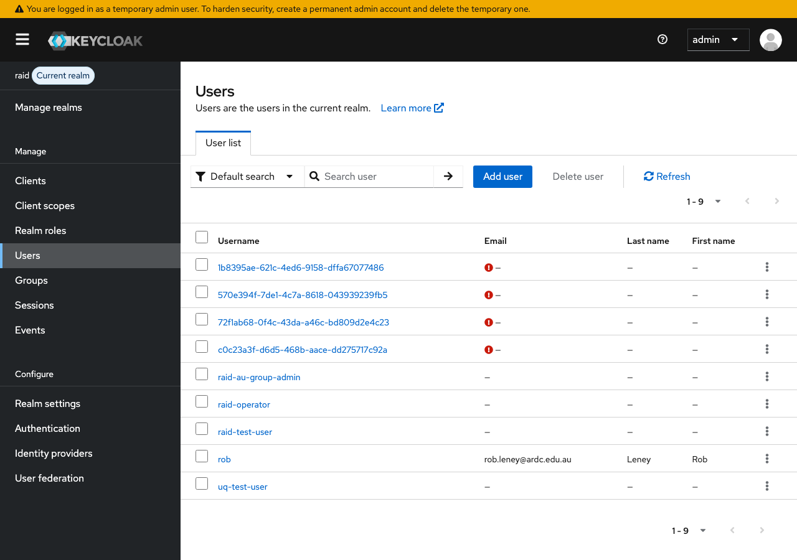
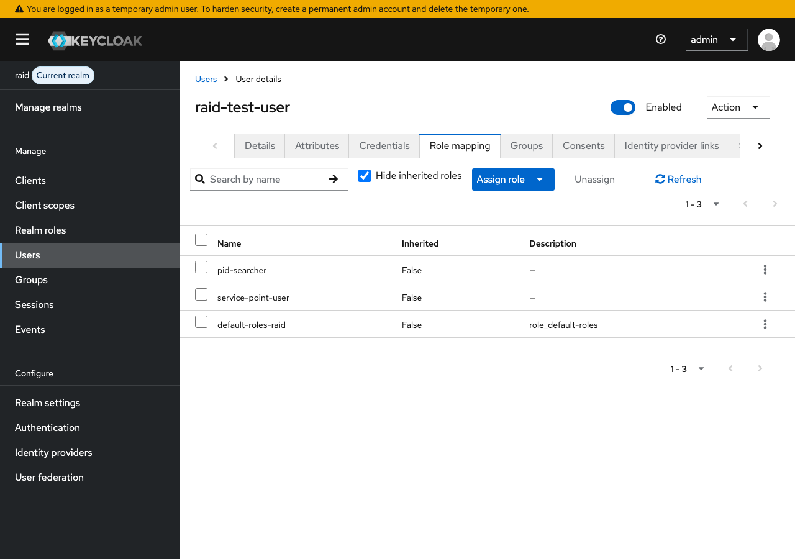
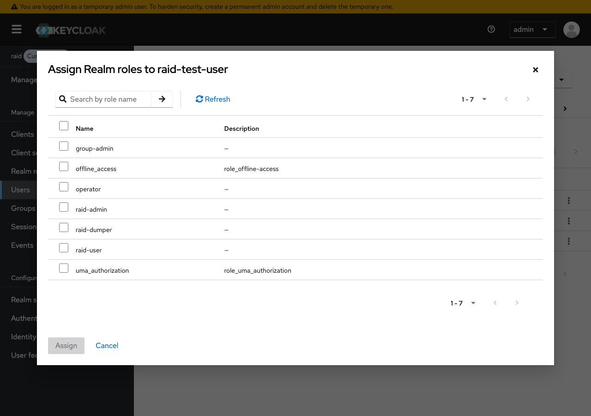
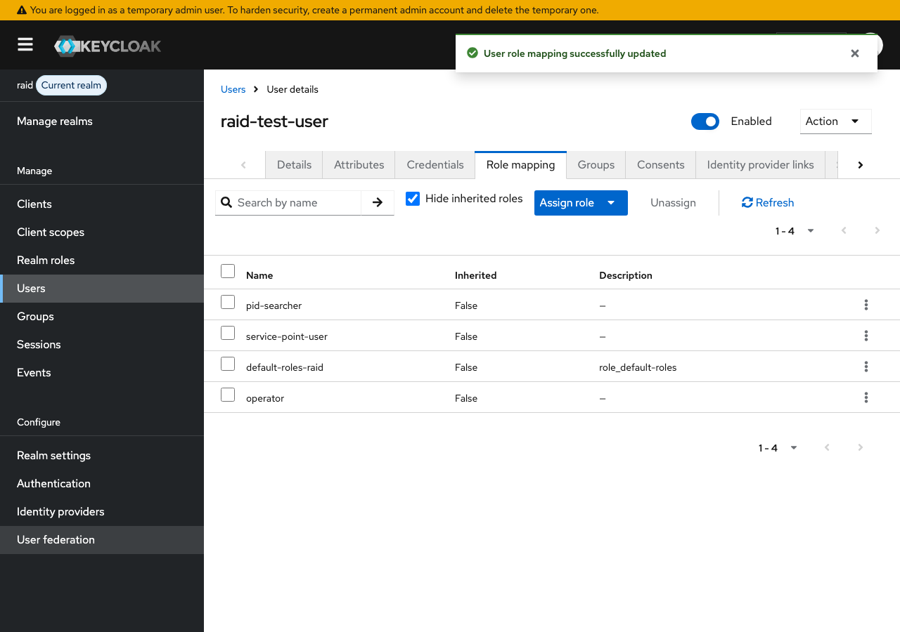

# RAiD US Keycloak Configuration Fix

This document identifies the Keycloak configuration issues in the RAiD US instance (`iam.demo.projectpid.org`) by comparing tokens against a correctly configured RAiD AU instance. The RAiD US token is missing critical claims and roles required by the RAiD API.

## Background

The `rspace` client (used by RSpace's RAiD integration) authenticates via the **Authorization Code flow** — a user logs in through the browser, RSpace receives an authorization code, and exchanges it for an access token. This is the same flow used by the RAiD AU frontend.

The error reported was `"No service point exists for group null"` when calling `GET https://api.demo.projectpid.org/raid/`.

## Problem Summary

The RAiD US Keycloak instance issues tokens that are missing three things the API requires:

1. **The `service_point_group_id` claim** is absent — the API cannot resolve which service point the user belongs to, resulting in `"No service point exists for group null"`
2. **The `scope` field is empty** — the `service_point_group_id` client scope is not assigned to the `rspace` client
3. **Realm roles are missing** — the user only has default Keycloak roles, not the application-specific roles (`service-point-user`, `operator`, etc.) required for authorization
4. **The `service_account` client scope is incorrectly assigned** — this injects `clientHost`, `clientAddress`, and `client_id` claims that should only appear in client credentials (service account) tokens, not authorization code tokens

Without items 1-3, the API will reject requests with `403 Service point not found` or similar authorization errors.

## Token Comparison

### RAiD US token (broken)

```json
{
  "iss": "https://iam.demo.projectpid.org/realms/raid",
  "azp": "rspace",
  "scope": "",
  "realm_access": {
    "roles": [
      "offline_access",
      "uma_authorization",
      "default-roles-raid"
    ]
  },
  "clientHost": "10.20.0.80",
  "clientAddress": "10.20.0.80",
  "client_id": "rspace"
}
```

### RAiD AU token (correct)

```json
{
  "iss": "http://localhost:8001/realms/raid",
  "azp": "raid-api",
  "scope": "service_point_group_id",
  "realm_access": {
    "roles": [
      "group-admin",
      "offline_access",
      "service-point-user",
      "uma_authorization",
      "default-roles-raid",
      "operator"
    ]
  },
  "service_point_group_id": "169bd3f3-dd42-4ac0-b89a-fb49648e5eff"
}
```

### Key differences

| Claim | RAiD US (broken) | RAiD AU (correct) | Impact |
|---|---|---|---|
| `scope` | `""` (empty) | `"service_point_group_id"` | Client scope not assigned to client |
| `service_point_group_id` | **missing** | `"169bd3f3-..."` | API cannot resolve service point — causes `"group null"` error |
| `realm_access.roles` | Only default roles | Includes `service-point-user`, `operator`, `group-admin` | API denies all authorized operations |
| `clientHost` / `clientAddress` / `client_id` | Present | Absent | The `service_account` scope is incorrectly assigned to the client (see Fix 4) |

> **Note:** The `clientHost`, `clientAddress`, and `client_id` claims are injected by the `service_account` client scope, which maps session notes intended for client credentials (service account) tokens. These claims should not appear in authorization code flow tokens. Their presence indicates the `service_account` scope has been added as a default scope on the `rspace` client and should be removed.

## Fix Instructions

There are four changes required, each described below. Fixes 1-3 are critical (the API will not work without them). Fix 4 is cosmetic but recommended.

---

### Fix 1: Create the `service_point_group_id` Client Scope

The `service_point_group_id` client scope maps a user attribute into the access token so the API knows which service point the caller belongs to. This scope does not exist in RAiD US.

#### 1.1 Create the client scope

1. In the Keycloak admin console, navigate to **Client scopes** in the left sidebar
2. Click **Create client scope**

   

3. Fill in the form:

   | Field | Value |
   |---|---|
   | **Name** | `service_point_group_id` |
   | **Description** | Maps the user's active group ID to a token claim for RAiD service point resolution |
   | **Type** | `None` |
   | **Protocol** | `OpenID Connect` |

4. Click **Save**

   

#### 1.2 Add the User Attribute mapper

After saving the client scope:

1. Click the **Mappers** tab

   

2. Click **Add mapper** > **By configuration**

   

3. Select **User Attribute** from the list

   

4. Configure the mapper:

   | Field | Value |
   |---|---|
   | **Name** | `Group ID` |
   | **User Attribute** | `activeGroupId` |
   | **Token Claim Name** | `service_point_group_id` |
   | **Claim JSON Type** | `String` |
   | **Add to ID token** | On |
   | **Add to access token** | On |
   | **Add to userinfo** | On |
   | **Add to token introspection** | On |

   
   

5. Click **Save**

#### 1.3 Assign the client scope to the `rspace` client

1. Navigate to **Clients** and select the **rspace** client
2. Go to the **Client scopes** tab
3. Click **Add client scope**
4. Select `service_point_group_id` and add it as **Default**

   

---

### Fix 2: Assign Realm Roles to the User

The user who logs in via the authorization code flow needs realm roles assigned. Without them, the `realm_access.roles` claim only contains Keycloak defaults (`offline_access`, `uma_authorization`, `default-roles-raid`) and the API will deny all operations.

#### 2.1 Find the user

1. Navigate to **Users** in the left sidebar
2. Search for the user who will be using the RSpace integration (e.g. the RSpace service user or the individual user account)

   

#### 2.2 Assign realm roles

1. Select the user and go to the **Role mapping** tab

   

2. Click **Assign role**

   

3. Filter by realm roles and assign at minimum:

   | Role | Purpose |
   |---|---|
   | **`service-point-user`** | Required to mint and manage RAiDs within a service point |

   Depending on what the user needs to do, you may also assign:

   | Role | Purpose |
   |---|---|
   | `operator` | Full system access — only if the user needs cross-service-point admin access |
   | `group-admin` | Group management — only if the user needs to manage group membership |
   | `pid-searcher` | Only if the user needs to search RAiDs by contributor/organisation PID |

   
   

> **Minimum required:** `service-point-user` is the essential role for minting and managing RAiDs. See [Role Permissions](role-permissions.md) for full details on what each role allows.

---

### Fix 3: Set the `activeGroupId` Attribute on the User

The `service_point_group_id` claim is populated from the user's `activeGroupId` attribute. This must be set for each user who will mint or manage RAiDs.

#### 3.1 Prerequisites

Before setting the attribute, you need:
- A **group** in Keycloak with a `groupId` attribute set to the group's UUID
- A **service point** in the RAiD database whose `group_id` column matches this UUID

If no group exists yet, create one first — see [Service Point Group ID](service-point-group-id.md) for full instructions.

#### 3.2 Set the attribute

1. Navigate to **Users** and select the user
2. Go to the **Attributes** tab
3. Add an attribute:

   | Key | Value |
   |---|---|
   | `activeGroupId` | The UUID of the Keycloak group (must match a service point's `groupId` in the database) |

   

4. Click **Save**

#### 3.3 Add the user to the group

1. On the same user, go to the **Groups** tab
2. Click **Join Group** and select the group

   

---

### Fix 4: Remove the `service_account` Client Scope from the `rspace` Client

The `rspace` client has the `service_account` client scope assigned as a default scope. This scope injects `clientHost`, `clientAddress`, and `client_id` claims via session note mappers — claims that are only meaningful for client credentials (service account) tokens.

Since `rspace` uses the **Authorization Code flow**, this scope should be removed:

1. Navigate to **Clients** and select the **rspace** client
2. Go to the **Client scopes** tab
3. Find `service_account` in the list of assigned scopes
4. Remove it (click the kebab menu or select and remove)

This is cosmetic rather than breaking — the extra claims don't cause errors — but they are misleading and shouldn't be in authorization code flow tokens.

---

## Verification

After applying all four fixes, have the RSpace user log in again and generate a new token via the authorization code flow. Decode the access token (e.g. at [jwt.io](https://jwt.io)) and verify:

- [ ] `scope` includes `service_point_group_id`
- [ ] `service_point_group_id` claim is present with the correct group UUID
- [ ] `realm_access.roles` includes `service-point-user` (and any other assigned roles)
- [ ] `clientHost`, `clientAddress`, `client_id` claims are **absent** (these belong in service account tokens only)

A correctly configured authorization code flow token should look like:

```json
{
  "azp": "rspace",
  "sid": "...",
  "scope": "service_point_group_id",
  "realm_access": {
    "roles": [
      "offline_access",
      "service-point-user",
      "uma_authorization",
      "default-roles-raid"
    ]
  },
  "service_point_group_id": "<group-uuid>"
}
```

For quick testing with the password grant (direct access grants must be enabled on the client):

```bash
curl -X POST "https://iam.demo.projectpid.org/realms/raid/protocol/openid-connect/token" \
  -H "Content-Type: application/x-www-form-urlencoded" \
  -d "client_id=rspace" \
  -d "client_secret=YOUR_CLIENT_SECRET" \
  -d "username=YOUR_USERNAME" \
  -d "password=YOUR_PASSWORD" \
  -d "grant_type=password"
```

## Troubleshooting

| Symptom | Cause | Fix |
|---|---|---|
| `"No service point exists for group null"` | `service_point_group_id` claim is missing from the token | Ensure the `service_point_group_id` client scope is added to the `rspace` client (Fix 1) AND the user has the `activeGroupId` attribute set (Fix 3) |
| `scope` field still empty | Client scope created but not assigned to the client | Go to **Clients** > **rspace** > **Client scopes** tab and add `service_point_group_id` as Default |
| Roles still missing from token | Roles not assigned to the user who is logging in | Ensure **realm roles** are assigned to the actual user (not a service account user) — see Fix 2 |
| `403 Service point not found` with a valid UUID | The `activeGroupId` value doesn't match any service point's `groupId` in the database | Verify a service point exists with a matching `group_id` — see [Service Point Group ID](service-point-group-id.md#create-a-service-point-with-the-keycloak-group-id) |
| `clientHost`/`clientAddress`/`client_id` still appearing in token | `service_account` scope still assigned to the client | Remove the `service_account` scope from the `rspace` client's default scopes (Fix 4) |

## Related Documentation

- [Service Point Group ID](service-point-group-id.md) — Full setup guide for the `service_point_group_id` claim
- [Client Credentials Flow](client-credentials-flow.md) — Creating a client credentials client from scratch
- [Authorization Code Flow](authorization-code-flow.md) — The flow used by RSpace
- [Role Permissions](role-permissions.md) — What each realm role allows
- [Keycloak Configuration](keycloak-configuration.md) — Complete realm configuration reference
- [Add Role to User](add-role-to-user.md) — Step-by-step role assignment with screenshots
