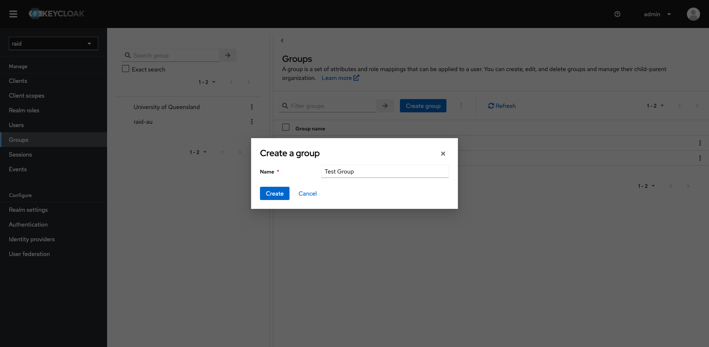
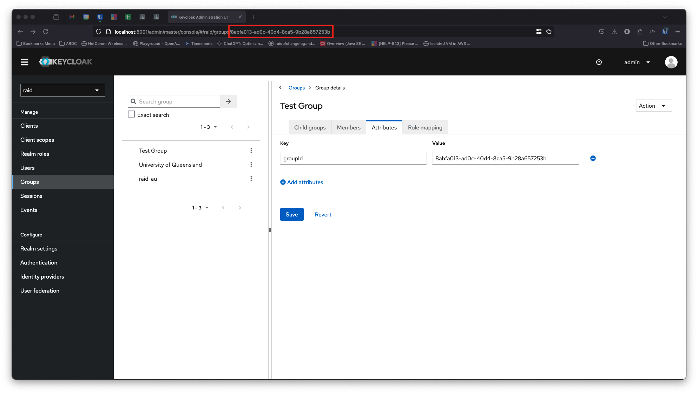
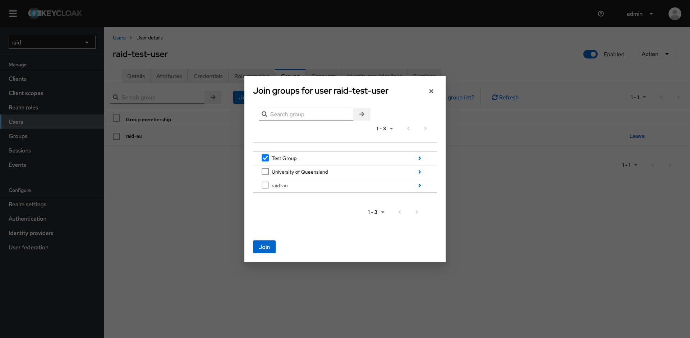
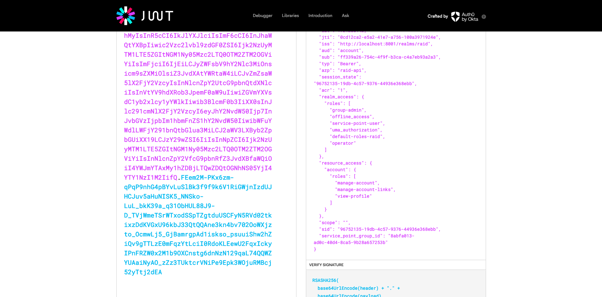

# Service Point Group ID

In order for a user to mint RAiDs they must be a member of a group in Keycloak and have access to a repository in DataCite. In RAiD, a Service Point connects the Keycloak group to a DataCite repository. For the API to identify the correct service point, the access token must include the `service_point_group_id` claim. The user must also have the `service-point-user` role.

A user can belong to many Keycloak groups, but when minting a RAiD the API needs to know which DataCite repository to store it in. For this reason we have the concept of an "active group" — the group that maps to a service point presented to the API at the point of minting. For users that belong to more than one group, the active group can be set in the RAiD UI. Behind the scenes this sets the `activeGroupId` user attribute, which is mapped to the `service_point_group_id` token claim.

```
User attribute: activeGroupId  →  Token claim: service_point_group_id  →  API: ServicePointService.findByGroupId()
```

## Prerequisites

- Access to the Keycloak admin console (e.g. `http://localhost:8001/admin`)
- Admin privileges on the target realm (e.g. `raid`)

## Step 1: Create a Group

1. Click on **Groups** then click **Create group**
2. Enter a name for the group and click **Create** 
3. Click on the newly created group and select the **Attributes** tab
4. Enter `groupId` as the key and the id of the group (the UUID found in the URL in the address bar of your browser) as the value. Click **Save** 

## Step 2: Create the Client Scope

1. Navigate to **Client scopes** in the left sidebar
2. Click the **Create client scope** button 
3. Fill in the form:
   - **Name**: `service_point_group_id`
   - **Description**: (optional) e.g. "Maps the user's active group ID to a token claim for RAiD service point resolution"
   - **Type**: `None`
   - **Protocol**: `OpenID Connect`
4. Click **Save** 

## Step 3: Add a User Attribute Mapper

After saving the client scope, you will be taken to the scope detail page.

1. Click the **Mappers** tab 
2. Click the **Add mapper** dropdown and select **By configuration** 
3. Select **User Attribute** 
4. Configure the mapper with these values:

| Field | Value |
|---|---|
| **Name** | `Group ID` (or any descriptive name) |
| **User Attribute** | `activeGroupId` |
| **Token Claim Name** | `service_point_group_id` |
| **Claim JSON Type** | `String` |
| **Add to ID token** | `On` |
| **Add to access token** | `On` |
| **Add to userinfo** | `On` |
| **Add to token introspection** | `On` |


5. Click **Save**

## Step 4: Create a Client (skip if you already have one)

1. Click on **Clients** and click the **Create client** button
2. Enter an id in the **Client ID** field. Click **Next**
3. On the following screen accept all the default values and click **Next**
4. On the following screen leave the fields blank and click **Save**

## Step 5: Add the Client Scope to a Client

1. Navigate to **Clients** and select the client that your application uses (e.g. `raid`)
2. Go to the **Client scopes** tab
3. Click **Add client scope**
4. Select `service_point_group_id` and click **Add** (as Default or Optional) 

## Step 6: Add Your User to the Group

1. Click on **Users** and select your user
2. Select the **Groups** tab and click the **Join Group** button
3. Select the group and click **Join** 

## Step 7: Set the User's Active Group

Each user who needs to mint RAiDs must have the `activeGroupId` attribute set to the UUID of their Keycloak group.

1. Navigate to **Users** and select the user
2. Go to the **Attributes** tab
3. Add an attribute with key `activeGroupId` and value set to the group's UUID 

## Verification

Request an access token (replace values as necessary):

```bash
curl --location 'https://[your keycloak host]/realms/[your realm]/protocol/openid-connect/token' \
--header 'Content-Type: application/x-www-form-urlencoded' \
--data-urlencode 'client_id=[your client id]' \
--data-urlencode 'username=[your username]' \
--data-urlencode 'password=[your password]' \
--data-urlencode 'grant_type=password' \
--data-urlencode 'client_secret=[your client secret]'
```

Decode the token (e.g. at [jwt.io](https://jwt.io)). You should see the `service_point_group_id` claim:

```json
{
  "service_point_group_id": "8abfa013-ad0c-40d4-8ca5-9b28a657253b",
  ...
}
```



## Create a Service Point with the Keycloak Group ID

```bash
curl --location --globoff '{{scheme}}://{{host}}/service-point/' \
--header 'Content-Type: application/json' \
--header 'Authorization: Bearer {{token}}' \
--data-raw '{
    "name": "Raid AU",
    "repositoryId": "NPQS.RKFZRK",
    "prefix": "10.82841",
    "identifierOwner": "https://ror.org/038sjwq14",
    "password": "******",
    "adminEmail": "someone@example.org",
    "techEmail": "someone@example.org",
    "enabled": true,
    "appWritesEnabled": true,
    "groupId": "8abfa013-ad0c-40d4-8ca5-9b28a657253b"
}'
```

## Troubleshooting

| Symptom | Cause | Fix |
|---|---|---|
| `403 Service point not found` with `"No service point exists for group null"` | `service_point_group_id` claim is missing from the token | Ensure the client scope is added to the client AND the user has the `activeGroupId` attribute set |
| `403 Service point not found` with a valid UUID | The `activeGroupId` value doesn't match any service point's `groupId` | Verify the service point exists with a matching `groupId` in the `service_point` table |
| Claim not appearing in token | Client scope not assigned to the client, or mapper misconfigured | Check that the scope is listed under the client's "Client scopes" tab and the mapper has "Add to access token" enabled |
